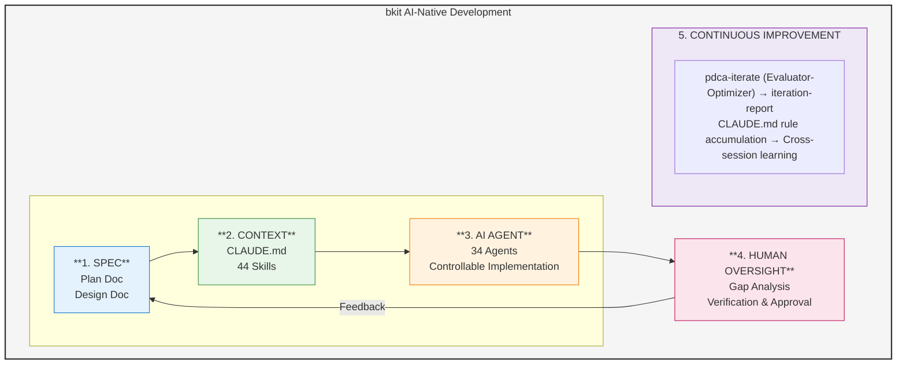

# AI-Native Development Methodology with bkit

## Overview

This document explains what AI-Native development means in the current market and how bkit realizes these principles to transform software development.

### bkit AI-Native Development Flow



---

## What is AI-Native Development?


AI-Native development is a paradigm where AI is not just a tool, but a **core collaborator** in the software development process. Unlike traditional development with AI assistance, AI-Native development fundamentally rethinks how software is designed, built, and maintained.

### Key Characteristics (Industry Consensus)

| Characteristic | Description |
|----------------|-------------|
| **Built on AI** | AI is integrated from the ground up, not added as an afterthought |
| **Break Constraints** | Removes traditional limitations on development speed and scale |
| **Continuously Improve** | Systems that get better through AI-driven iteration |
| **Proprietary AI** | Custom AI workflows tailored to specific development needs |

---

## The 4 AI-Native Principles

Based on research from industry leaders (Addy Osmani, Sapphire Ventures, DevOps.com, Augment), we identify four core principles:

### 1. Specification-Driven Development

**Principle**: Clear specifications enable AI to generate accurate, consistent code.

**Traditional Approach**:
- Write code first, document later
- Specifications often incomplete or outdated
- AI generates generic code without context

**AI-Native Approach**:
- Comprehensive specs before implementation
- Living documentation that evolves with code
- AI generates context-aware, project-specific code

### 2. Context-Aware Development

**Principle**: AI must understand project context to make intelligent decisions.

**Key Elements**:
- Project structure and conventions
- Existing code patterns and styles
- Business domain knowledge
- Team preferences and constraints

### 3. AI Agents as Developers

**Principle**: AI agents perform substantial development work autonomously.

**Capabilities**:
- Independent task completion
- Multi-step problem solving
- Automated testing and validation
- Self-correction through iteration

### 4. Human Oversight by Design (Controllable AI)

**Principle**: Humans govern AI through progressive trust, 5-level automation control, and interactive checkpoints.

**bkit v2.0.3 Controllable AI**:
- **L0-L4 automation levels**: Manual → Guided → Semi-Auto → Auto → Full-Auto
- **Interactive Checkpoints (v2.0.3)**: 5 AskUserQuestion gates — Plan (requirements + questions), Design (3 architecture options), Do (scope approval), Check (fix strategy)
- **Confidence-Based Analysis (v2.0.3)**: code-analyzer reports only ≥80% confidence issues with Critical/Important severity
- **Trust Score (0-100)**: Earned through track record, 6 weighted components
- **Quality Gates (7 stages)**: Configurable thresholds per phase transition
- **Audit trail**: JSONL logging + decision tracer for full transparency
- **Emergency stop**: Immediate pause with checkpoint/rollback support
- **Destructive detection**: 8 rules (rm -rf, git push --force, etc.) with blast radius analysis

---

## AI-Native Engineer Mindset

According to Addy Osmani's research on AI-Native engineers, effective practitioners exhibit these characteristics:

### 1. Strategic Thinking
- Frame problems clearly before engaging AI
- Break complex tasks into manageable steps
- Provide relevant context upfront

### 2. Iterative Refinement
- Use AI output as starting point, not final product
- Continuously improve through feedback loops
- Build on what works, discard what doesn't

### 3. Quality Verification
- Always review AI-generated code
- Test edge cases and error handling
- Validate against requirements

### 4. Context Engineering (v2.0.0)

Context Engineering is the **systematic design of information flow to LLMs**—going beyond simple prompt crafting to build entire systems that consistently guide AI behavior.

**Key Practices**:
- Design multi-layered context injection systems (21 hook events, 6 layers)
- Build state management with declarative state machines (20 transitions, 9 guards)
- Create adaptive triggers based on user intent (8-language, auto-detection)
- Implement quality feedback loops with quality gates and metrics (M1-M10)

**bkit v2.1.13 Implementation**:
```
Domain Knowledge (44 Skills) ────────┐
Behavioral Rules (34 Agents) ────────┤
State Management (190 modules / 22 subdirs, Clean Arch 4-Layer + Application pilot) ─┤
3-Layer Orchestration ────┼─→ 21-Event Hook System (24 blocks, 61 scripts)
  ├─ intent-router (feature>skill>agent)                         │    ─→ Dynamic Context Injection
  ├─ next-action-engine (Stop-family)                           │
  ├─ team-protocol (PM/CTO/QA Lead)                             │
  └─ workflow-state-machine (matchRate SSoT 90)                 │
Workflow Engine (3 presets) ─────────┤
Controllable AI (L0-L4 + fast-track Daniel-mode) ────────────────┤
Defense-in-Depth 4-Layer (CC→bkit→audit-logger→Token Ledger) ──┤
Invocation Contract L1~L5 (226 CI-gated + L2 + L3 MCP + L5 E2E)┤
7 Port↔Adapter pairs (cc-payload, state-store, regression-registry, audit-sink, token-meter, docs-code-index, mcp-tool) ──┤
Quality Gates M1-M10 (catalog + check-quality-gates-m1-m10.js) ─┤
i18n (KO/EN full + 6-lang fallback, error-friendly localization) ┤
Audit System (JSONL traces, PII 7-key redaction) ──────────────┘
```

See [bkit-system/philosophy/context-engineering.md](bkit-system/philosophy/context-engineering.md) for detailed implementation.

---

## How bkit Realizes AI-Native Development

bkit implements each AI-Native principle through specific features and workflows:

### Principle 1: Specification-Driven Development

| bkit Feature | Implementation |
|--------------|----------------|
| **PDCA Plan Phase** | Creates detailed specifications before coding |
| **PDCA Design Phase** | Defines architecture, APIs, data models |
| **Document Templates** | Standardized formats for consistent specs |
| **Schema Skill (Phase 1)** | Establishes terminology and data structures |

**Workflow**:
```
/pdca plan {feature}    → Create specification
/pdca design {feature}  → Design architecture
→ AI generates code from specs
```

### Principle 2: Context-Aware Development (Context Engineering)

bkit implements **Context Engineering**—the systematic curation of context tokens for optimal LLM inference.

| bkit Feature | Implementation |
|--------------|----------------|
| **3 Project Levels** | Starter, Dynamic, Enterprise contexts |
| **Convention Skill (Phase 2)** | Defines naming, structure, patterns |
| **CLAUDE.md Files** | Project-specific AI instructions |
| **Skill System (44 skills)** | Domain-specific knowledge (v2.1.11 added bkit-evals, bkit-explore, pdca-watch, pdca-fast-track) |
| **21-Event Hook System** | Centralized context injection via hooks.json (21 events / 24 blocks, 61 scripts); 3 attribution sites (Stop/SessionEnd/SubagentStop) |
| **lib/ (190 modules)** | 22 subdirectories Clean Architecture 4-Layer with 7 Port↔Adapter pairs: application (v2.1.11 γ2 pilot), audit, cc-regression, control, core, **dashboard** (v2.1.11 β4), **defense**, **discovery** (v2.1.11 β1), **domain**, **evals** (v2.1.11 β2), **i18n** (v2.1.11 β3/β6), **infra**, intent, **orchestrator**, pdca, qa, quality, **sprint** (v2.1.13), task, team, ui, **util** |

**Context Engineering Architecture (v2.1.13)**:
```
┌─────────────────────────────────────────────────────────────────┐
│              bkit v2.1.13 Context Engineering Layers             │
├─────────────────────────────────────────────────────────────────┤
│  Layer 1: Domain Knowledge   │ 44 Skills (structured knowledge)  │
│  Layer 2: Behavioral Rules   │ 34 Agents (role + constraints)    │
│  Layer 3: State Management   │ State machine, workflow engine    │
│  Layer 4: Dynamic Injection  │ Intent detection, 8-lang triggers │
│  Layer 5: Controllable AI    │ L0-L4 automation, trust score     │
│  Layer 6: Quality & Audit    │ 7 gates, M1-M10 metrics, audit   │
│  Layer 7: Feedback Loop      │ Match Rate → Iteration (max 5)   │
│  Layer 8: Meta-Container     │ Sprint (8-phase, 4 auto-pause)    │
└─────────────────────────────────────────────────────────────────┘
```

**Context Injection Flow**:
```
User Message → Intent Detection → Skill/Agent Trigger →
→ State Injection → Tool Hooks → Response → Feedback Loop
```

### Principle 3: AI Agents as Developers

| bkit Feature | Implementation |
|--------------|----------------|
| **36 Specialized Agents** | cto-lead, code-analyzer, gap-detector, pm-lead, self-healing, etc. |
| **Evaluator-Optimizer Pattern** | Automatic iteration cycles |
| **gap-detector Agent** | Finds design-implementation gaps |
| **code-analyzer Agent** | Quality and security analysis |

**Agent Workflow**:
```
code-explorer → code-architect → implementation → code-reviewer → qa-monitor
```

### Principle 4: Human Oversight by Design

| bkit Feature | Implementation |
|--------------|----------------|
| **Interactive Checkpoints (v2.0.3)** | 5 AskUserQuestion gates: requirements, questions, architecture, scope, fix strategy |
| **PDCA Methodology** | Quality gate at each phase transition |
| **Confidence-Based Analysis** | code-analyzer reports only ≥80% confidence issues |
| **Iteration Reports** | Transparent progress documentation |

**Verification Points (v2.0.3 — State Machine + Quality Gates + Interactive Checkpoints)**:
```
idle → [PM Gate] → Plan [CP1: Requirements] [CP2: Questions]
  → [Plan Gate] → Design [CP3: 3 Architecture Options]
  → [Design Gate] → Do [CP4: Implementation Scope Approval]
  → [Do Gate] → Check [CP5: Fix Strategy Selection]
  → [Check Gate: ≥90%] → Report → Completed
  └──→ [Iterate Gate: <90%] → Act → Check (max 5)
```

### Principle 5: CTO-Led Agent Teams (v1.5.3)

**Principle**: A CTO agent orchestrates multiple specialized AI agents working in parallel, mimicking real development team dynamics.

| bkit Feature | Implementation |
|--------------|----------------|
| **CTO Lead Agent** | Orchestrates team composition, task assignment, and quality gates |
| **5 Team Agents** | frontend-architect, product-manager, qa-strategist, security-architect, cto-lead |
| **Parallel Execution** | Multiple agents work simultaneously on different aspects |
| **PDCA Integration** | `/pdca team {feature}` activates CTO-Led team workflow |

**CTO-Led Team Workflow**:
```
/pdca team {feature}
  → CTO analyzes feature scope
  → Selects optimal team composition (Dynamic: 3, Enterprise: 5 agents)
  → Spawns teammates in parallel
  → Assigns tasks based on expertise
  → Monitors progress and quality
  → Aggregates results
  → Team cleanup
```

**Team Composition by Level**:

| Level | Teammates | Agents |
|-------|-----------|--------|
| Dynamic | 3 | developer, qa, frontend |
| Enterprise | 5 | architect, developer, qa, reviewer, security |

**Requirements**: `CLAUDE_CODE_EXPERIMENTAL_AGENT_TEAMS=1` + Claude Code v2.1.32+

### Principle 6: Sprint as Meta-Container (v2.1.13)

**Principle**: For multi-feature initiatives that share scope, budget, or timeline, bkit groups features under a Sprint meta-container with its own 8-phase lifecycle and 4 auto-pause triggers — providing release-level orchestration on top of per-feature PDCA.

| bkit Feature | Implementation |
|--------------|----------------|
| **Sprint 8-phase lifecycle** | `prd → plan → design → do → iterate → qa → report → archived` (orthogonal to PDCA 9-phase) |
| **16 sub-actions** | init / start / status / list / watch / phase / iterate / qa / report / archive / pause / resume / fork / feature / help / master-plan |
| **4 Auto-Pause Triggers** | QUALITY_GATE_FAIL · ITERATION_EXHAUSTED · BUDGET_EXCEEDED · PHASE_TIMEOUT |
| **Trust Level scope L0-L4** | `SPRINT_AUTORUN_SCOPE` controls auto-run boundary (L4 Full-Auto = orchestrator advances until any trigger fires) |
| **7-Layer S1 dataFlowIntegrity QA** | UI → Client → API → Validation → DB → Response → Client → UI hop traversal |
| **4 Sprint Agents** | `sprint-master-planner` (plan generation, Context-Anchor-driven) + `sprint-orchestrator` (lifecycle, Sequential dispatch ENH-292 pattern) + `sprint-qa-flow` (S1 verification) + `sprint-report-writer` (cumulative KPI aggregation) |
| **Context Sizer** | Kahn topological sort + greedy bin-packing for sprint feature size estimation (max 100K tokens/sprint, 25% safety margin, dependency-aware) |
| **3 new MCP Tools** | `bkit_sprint_list` / `bkit_sprint_status` / `bkit_master_plan_read` |
| **7 new Templates** | `templates/sprint/{master-plan, prd, plan, design, iterate, qa, report}.template.md` |
| **2 Korean Guides** | `docs/06-guide/sprint-management.guide.md` (~330 lines) + `sprint-migration.guide.md` (PDCA↔Sprint orthogonal coexistence) |
| **2 ADRs** | ADR 0006 (CC Upgrade Policy) + ADR 0007 (Sprint as Meta-Container, backward-compat invariant) |

**Sprint Workflow**:
```
/sprint init my-launch --features f1,f2,f3 --trust L3
  → sprint-master-planner generates master plan + PRD + plan + design
  → /sprint start advances phases auto-run scope=Trust Level
  → 4 auto-pause triggers monitor in background
  → /sprint qa runs 7-Layer S1 dataFlowIntegrity
  → /sprint report aggregates KPI + lessons learned
  → /sprint archive transitions to terminal state (forward-only)
```

**Coexistence Model**: Sprint and PDCA are **orthogonal** — both may track concurrently. PDCA 9-phase remains per-feature; Sprint 8-phase is the meta-container. Trust Level directly drives `SPRINT_AUTORUN_SCOPE`: L0 manual+stopAfter=prd / L1 design / L2 do / L3 qa / L4 archived (full-auto). Also gates PDCA phase transitions and destructive operations.

See [skills/sprint/SKILL.md](skills/sprint/SKILL.md), [docs/06-guide/sprint-management.guide.md](docs/06-guide/sprint-management.guide.md), and [docs/06-guide/sprint-migration.guide.md](docs/06-guide/sprint-migration.guide.md) for the full reference, deep-dive, and PDCA-to-Sprint migration mapping.

---

## bkit's 3 Core AI-Native Competencies

### 1. Rapid Specification-to-Implementation

**Traditional**: Days to weeks from spec to working code
**With bkit**: 2-3 conversations for bulk implementation

```
Specification Document → PDCA Design → AI Implementation → Working Code
```

### 2. Automated Quality Iteration

**Evaluator-Optimizer Pattern**:
- Automatic gap detection between design and implementation
- Code quality analysis (security, performance, maintainability)
- Functional testing with Zero Script QA
- Self-healing through iteration cycles

```bash
/pdca iterate {feature}  # Runs until quality threshold met
```

### 3. Continuous Context Evolution

**Context builds over time**:
- Project grows → More context for AI
- More context → Better AI decisions
- Better decisions → Higher quality code
- Higher quality → Faster development

---

## Comparison: Traditional vs AI-Native with bkit


| Aspect | Traditional Development | AI-Native with bkit |
|--------|------------------------|---------------------|
| **Specification** | Optional, often skipped | Required, template-driven |
| **Context** | In developer's head | Documented, AI-accessible |
| **Code Generation** | Human writes everything | AI generates, human reviews |
| **Quality Assurance** | Manual testing, code review | Automated analysis + human oversight |
| **Iteration** | Manual fix cycles | Automatic Evaluator-Optimizer |
| **Documentation** | Afterthought | Continuous, integrated |
| **Learning Curve** | Tool-specific | Pattern-based, transferable |

---

## Getting Started with AI-Native Development

### Step 1: Initialize with Context
```bash
/starter      # or /dynamic, /enterprise
```

### Step 2: Create Specifications
```bash
/pdca plan {feature}
/pdca design {feature}
```

### Step 3: Implement with AI Agents
```bash
# AI implements based on specs
# Human reviews and refines
```

### Step 4: Iterate to Quality
```bash
/pdca iterate {feature}  # Automatic improvement cycles
/pdca analyze {feature}  # Gap analysis
```

### Step 5: Document and Learn
```bash
/pdca report {feature}   # Generate completion report
```

---

## References

- Addy Osmani - "The 70% Problem: Hard Truths About AI-Assisted Coding"
- Sapphire Ventures - "What Makes AI-Native Different"
- DevOps.com - "AI-Native vs AI-Enabled Development"
- Anthropic - "Building Effective Agents" (Evaluator-Optimizer Pattern)

---

## Conclusion

AI-Native development is not about using AI tools occasionally—it's about fundamentally restructuring how software is built. bkit provides the framework, methodology, and tools to make this transformation practical and achievable.

The key insight: **Specification quality determines AI output quality**. By enforcing structured documentation through PDCA methodology, bkit ensures that AI agents have the context they need to produce high-quality, consistent code.

---

*bkit - Vibecoding Kit for AI-Native Development*
*POPUP STUDIO PTE. LTD. - https://popupstudio.ai*
