# bkit — Full Reference

> The only Claude Code plugin that verifies AI-generated code against its own design specs.

> **The 5-minute version is in [README.md](README.md). This file is the deep one.** It exists for people who want to know exactly what `/sprint`, `/pdca`, and `/control` do, which agent runs in which phase, how the 11 quality gates measure things, and how the architecture stops AI from drifting. **Release history is in [CHANGELOG.md](CHANGELOG.md) and is not duplicated here.**

[](https://opensource.org/licenses/Apache-2.0)
[](https://code.claude.com)
[](CHANGELOG.md)
[](https://popupstudio.ai)

> **Requirement**: bkit requires Claude Code **v2.1.143 or later** (the strict plugin-manifest path recognizes the official `displayName` field only from v2.1.143). On older Claude Code you will see `Validation errors: Unrecognized key: "displayName"` during `claude plugin install`. Run `npm install -g @anthropic-ai/claude-code@latest` to upgrade, or see [`docs/06-guide/cc-compatibility.guide.md`](docs/06-guide/cc-compatibility.guide.md).

---

## Who this file is for

| You are… | Read this file because… |
|---|---|
| 🌱 **Vibe coder / non-developer** who saw the README and asked "but how does it actually work?" | Sections 0, 4.2, and 7.3 explain the moving parts in plain language with worked examples. You will not need to know Clean Architecture to follow them. |
| 👤 **Solo dev** evaluating bkit before installing | Sections 2, 3, 5, 8 cover the commands, the quality-gate thresholds, and the agent rosters. |
| 👥 **Team lead** thinking about adoption | Sections 6, 7, 9 cover Trust Level governance, Sprint planning, and the 4-Layer architecture / Invocation Contract that keeps drift out of the codebase. |
| 🛠️ **Plugin author** who wants to customise bkit | Section 11 covers the project-local override pattern; sections 9 and 10 cover the contract surface. |

## What you'll achieve by working through this file

The bkit promise: **anyone can ship robust, production-quality software with AI** — even if you've never written a unit test or seen a CI pipeline. This document explains the underlying mechanics so you can trust the workflow when it runs unattended at Trust Level 4.

| If you understand… | …you can rely on |
|---|---|
| **Section 4 — Workflow Internals** | bkit auto-running every PDCA phase. You'll know what happens in *pm*, *plan*, *design*, *do*, *check*, *act*, *qa*, *report*. |
| **Section 5 — Quality Gates** | bkit pausing before drift compounds. You'll know what M1, M3, M5, S1 measure and what bkit does when they fail. |
| **Section 6 — Trust Level** | Setting the autonomy dial confidently. You'll know exactly what L2 and L4 do differently. |
| **Section 7 — Sprint Management** | Releases that span sessions and weeks. You'll know how the Context Sizer keeps each sprint within a single Claude session window. |
| **Section 8 — Agent Teams** | Knowing which specialist to call. You'll know why `/pdca pm`, `/pdca team`, `/pdca qa` spawn different rosters. |

---

## Table of Contents

0. [Plain-language Glossary](#0-plain-language-glossary)
1. [Design Philosophy](#1-design-philosophy)
2. [The Three Commands](#2-the-three-commands)
3. [Command Cheat Sheet](#3-command-cheat-sheet)
4. [Workflow Internals](#4-workflow-internals)
5. [Quality Gates & Self-Repair](#5-quality-gates--self-repair)
6. [Trust Level & Control](#6-trust-level--control)
7. [Sprint Management Deep-Dive](#7-sprint-management-deep-dive)
8. [Agent Teams](#8-agent-teams)
9. [Architecture](#9-architecture)
10. [Skill Evals](#10-skill-evals)
11. [Installation & Customization](#11-installation--customization)
12. [Requirements](#12-requirements)
13. [Language Support](#13-language-support)
14. [License & Contributing](#14-license--contributing)

---

## 0. Plain-language Glossary

The terms used in this file, explained for someone who is new to AI-coding.

| Term | What it really means |
|---|---|
| **Claude Code** | The AI coding tool you talk to. Think of it as a coworker who lives in your terminal. |
| **Plugin** | Extra capabilities you bolt on to Claude Code. bkit is a plugin. |
| **bkit** | The plugin you're reading about. It adds 3 commands (`/sprint`, `/pdca`, `/control`), 44 skills, 34 specialist agents, 11 quality checks. |
| **Skill** | A bundle of instructions Claude Code reads to remember "how do I run a PDCA cycle?" or "how do I plan a sprint?" When you type `/pdca`, a skill activates. |
| **Agent** | A specialist version of Claude Code that knows one job very well — e.g. `frontend-architect`, `qa-lead`, `gap-detector`. The agent's job is in its name. |
| **Hook** | A piece of code that runs *around* AI actions. bkit's hooks intercept dangerous actions (deleting files, leaking secrets), log every step, and inject context. There are 21 hook events Claude Code fires. |
| **Context** | Everything the AI knows at the moment it decides what to write — your prompt, the file it just read, the rules it was given, its memory. AI quality is mostly about getting the right context to the AI at the right moment. |
| **Context Engineering** | A discipline that says: *don't try to write the perfect prompt — build a system that gives the AI the right context every time.* bkit is a Context Engineering system. |
| **PDCA** | Plan → Do → Check → Act. A 70-year-old continuous improvement loop. bkit's 9-phase version is `pm → plan → design → do → check → act → qa → report → archive`. |
| **Sprint** | A *container* that groups multiple features under a shared budget and timeline. Each sprint runs through its own 8 phases. A sprint can contain many features, each going through PDCA. |
| **Match rate** | A percentage measuring how much of your *design spec* actually appears in the *generated code*. 90 % means the AI did 90 % of what was specified. bkit auto-repairs anything below that. |
| **Quality gate** | A hard stop that won't let the workflow advance until a measurable rule is satisfied. bkit has 11 of them. |
| **Trust Level (L0–L4)** | The dial that decides how far the AI runs unattended. L0 = "ask me at every step", L4 = "wake me when it's done". |
| **Auto-pause trigger** | A condition that pauses an automated run so a human can intervene. bkit has 4: quality gate fail, iteration exhausted, budget exceeded, phase timeout. |
| **Audit log** | A permanent record of every important action bkit took, with sensitive data scrubbed out. Lives in `.bkit/runtime/audit-log.ndjson`. |
| **MCP** | Model Context Protocol — Anthropic's standard way to plug data sources into Claude Code. bkit ships 2 MCP servers (`bkit-pdca`, `bkit-analysis`) exposing 19 tools. |
| **Docs = Code** | bkit's principle that says "every feature must produce design docs, and the code must match those docs." A CI gate enforces 0 drift. |

---

## 1. Design Philosophy

bkit is not a productivity hack. It brings **engineering discipline** to AI-native development.

The software industry refined how *humans* write code over decades — version control, code review, CI/CD, testing pyramids. When AI enters the loop, most of that discipline evaporates: developers prompt, accept, ship. Documentation becomes an afterthought. Quality becomes luck.

**bkit exists because AI-assisted development deserves the same rigor as traditional engineering.**

### 1.1 What we optimise for

| We optimise for | Over | Concretely |
|---|---|---|
| **Process** | Output | One feature through proper planning + design + implementation + verification beats ten hacked-together features. The PDCA cycle *is* the product. |
| **Verification** | Trust | AI generates plausible code. Plausible is not correct. Every implementation goes through gap analysis. Below 90 % match, the system iterates. We do not ship hope. |
| **Context** | Prompts | A clever prompt helps once. A systematic context system helps every time. 44 skills + 34 agents + 190 lib modules exist so the AI receives the right context at the right moment. |
| **Constraints** | Features | Three project levels, not infinite configuration. Fixed 9-phase PDCA and 8-phase Sprint, not a customizable workflow builder. Opinionated defaults eliminate decision fatigue. |

> *"We do not offer a hundred features. We engineer each one through proper design and verification. That is the difference between a tool and a discipline."*

### 1.2 The three core philosophies (the contract with you)

These come from [`bkit-system/philosophy/core-mission.md`](bkit-system/philosophy/core-mission.md). Every line of bkit code is judged against them.

| # | Principle | What it means for you, the user |
|---|---|---|
| 1 | **Automation First** | You don't need to memorise PDCA. You don't need to know which skill to call. Describe what you want; the intent-router (`lib/orchestrator/intent-router.js`) picks the right skill or agent. The state machine drives the rest. Manual is the fallback, not the default. |
| 2 | **No Guessing** | bkit refuses to fabricate. If `gap-detector` is unsure, it reads the spec again. If still unsure, it asks you via AskUserQuestion — it does not invent. 11 quality gates + `design-validator` + `code-analyzer` enforce this. |
| 3 | **Docs = Code** | Every feature produces docs: PRD + plan + design + analysis + completion report. The docs are the contract; the code must match. `scripts/docs-code-sync.js` runs in CI and fails the build if the doc-side counts drift from the code-side counts. |

### 1.3 Context Engineering — the deeper "why"

Most AI-coding tools focus on *prompts*. bkit focuses on *context*. The distinction is the entire reason bkit exists.

A prompt is a single message you send. Context is the entire information environment the AI is working inside — your conventions, your prior decisions, your design spec, the rules you set, the memory of last week's session, the audit trail of what changed.

> *"bkit is a practical implementation of Context Engineering — a systematic discipline for building, maintaining, and verifying the right context for AI-assisted development."* — [`bkit-system/philosophy/context-engineering.md`](bkit-system/philosophy/context-engineering.md)

| Symptom of bad context | What goes wrong | How bkit fixes it |
|---|---|---|
| AI hallucinates names, paths, or APIs that don't exist | The AI has no real grounding in your code | **Skills** auto-load the right grounding (PDCA rules, Sprint state, your style guide). 44 skills, 8-language auto-trigger. |
| AI is confident but wrong | The AI doesn't know what "correct" means in your project | **gap-detector** measures match rate against the design spec; **code-analyzer** checks quality scores. Wrong is detected, not assumed away. |
| AI loses focus halfway through | Context window overflows in long sessions | **Sprint Management** splits work into context-budgeted chunks (≤ 75 K tokens each). **Memory** + **Task Management** survive session clears. |
| You ship and then discover the bug | No verification was ever run | **11 quality gates** run between phases. Failing a gate auto-pauses. |
| You ship and the new dev can't tell what changed | No audit trail | **Audit log** + **Token Ledger** + **Docs = Code** keep a permanent record. |

### 1.4 Controllable AI — the principles behind /control

These come from [`AI-NATIVE-DEVELOPMENT.md`](AI-NATIVE-DEVELOPMENT.md). They are why bkit ships a Trust Level dial instead of "AI off / AI on".

| Principle | What it gives you |
|---|---|
| **Safe defaults** | Out of the box, bkit asks before doing anything destructive. Trust Level starts at L2 (Semi-Auto). |
| **Progressive trust** | As your `matchRate` track record improves, bkit's Trust Score can recommend a higher level — but never silently. |
| **Full visibility** | Every phase emits an audit entry. `/sprint status`, `/sprint watch`, `/pdca status` show you the current state at any moment. |
| **Always interruptible** | `Ctrl+C` cancels. `/sprint pause` halts. `pdca-iterator` auto-stops after 5 cycles. 4 auto-pause triggers guarantee the run never gets away from you. |

---

## 2. The Three Commands

Everything else in bkit — 44 skills, 34 agents, 21 hooks, 11 quality gates, 226+ contract assertions — exists to make these three commands work reliably.

| Command | One-line purpose | When you use it |
|---|---|---|
| **`/sprint`** | Group multiple features into a release container, plan them, and run them. | Quarter launch, milestone, 2+ linked features sharing scope/budget/timeline |
| **`/pdca`** | Drive a single feature from PRD to release-ready report through 9 phases. | A single feature, *or* inside a sprint (the orchestrator calls /pdca per feature automatically) |
| **`/control`** | One dial setting how much of `/sprint` and `/pdca` runs unattended. | Anytime. The setting persists. |

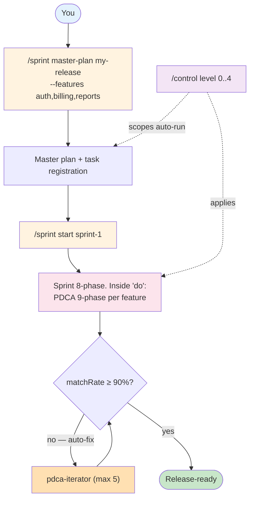

### The sprint user journey, step by step

| Step | What you type | What bkit does | Output |
|---|---|---|---|
| **1. Plan** | `/sprint master-plan my-release --name "Q2 Launch" --features auth,billing,reports` | `sprint-master-planner` writes a Context-Anchor-driven master plan. The Context Sizer (Kahn topological + greedy bin-packing) splits features into ≤ 75 K-token sprints honoring dependencies. | `docs/01-plan/features/my-release.master-plan.md` + per-sprint `prd` / `plan` / `design` templates; `.bkit/state/master-plans/my-release.json`; audit entry `master_plan_created` |
| **2. Register** | (automatic in Step 1) | Each sprint in `plan.sprints[]` becomes a task via `TaskCreate`. Cross-sprint `dependsOn` becomes task `blockedBy`. | One task per sprint, Kahn-ordered. Visible via `/sprint list` or `TaskList` |
| **3. Execute** | `/sprint start my-release-s1` | `sprint-orchestrator` advances the 8-phase sprint. Inside `do`, **PDCA 9-phase runs once per feature** — `pm-lead` PRD, `cto-lead` team spawn, `gap-detector` measure, `pdca-iterator` repair, `qa-lead` test, `report-generator` summarize. | Per-feature artifacts under `docs/00-pm/...`, `docs/01-plan/features/...`, `docs/02-design/features/...`, `docs/04-report/features/...`; sprint state `.bkit/state/sprints/my-release-s1.json` |
| **4. Govern** | `/control level 0..4` (anytime) | The dial scopes how far both Sprint and PDCA phases auto-advance before stopping. Trust Score (0–100) can also recommend a level from your track record. | `.bkit/state/trust-profile.json`; effective scope mirrored into `lib/control/automation-controller.js:SPRINT_AUTORUN_SCOPE` (L3 contract test SC-07 enforces the 1:1 mirror) |

**Single feature shortcut**: skip steps 1–2 and run `/pdca pm <feature>` directly. Step 4 still applies.

### 2.1 Why each step exists — the worked detail

The 4 steps map directly to the user experience the bkit author had in mind. Each one is a deliberate answer to a specific failure mode of AI-assisted development.

**Step 1 — Plan the release in depth, not in haste.**

When you type `/sprint master-plan my-release --features auth, billing, reports`, bkit does **not** rush to a plan. The `sprint-master-planner` agent runs deliberately:

- If your repo is non-trivial, it explores your existing code (`Task(Explore)`) before assuming anything about your conventions.
- If your feature involves a domain it doesn't already know (e.g., a payment provider you haven't integrated before), it does web research first.
- Then it splits your features into **context-budgeted Sprints** using:
  - **Kahn topological sort** — to respect "billing depends on auth" type relationships.
  - **Greedy bin-packing** — to keep each sprint ≤ 75 K tokens, so a single Claude Code session can finish the sprint without running out of context.
- Finally it writes a master plan with a **Context Anchor** (WHY / WHO / WHAT / RISK / SUCCESS / SCOPE) that every later phase reads.

You can also call specialist agents directly when you want more depth for a particular feature:

| Command | What it spawns | Output |
|---|---|---|
| `/pdca pm <feature>` | 4 PM agents in parallel (`pm-discovery` + `pm-strategy` + `pm-research` + `pm-prd`) using 43 product-management frameworks (JTBD, Lean Canvas, SWOT, PESTLE, Porter's, Pre-mortem, Personas, TAM/SAM/SOM, …) | A comprehensive PRD at `docs/00-pm/<feature>.prd.md` |
| `/pdca team <feature>` | A multi-specialist implementation team led by `cto-lead` — 4–6 agents in parallel (developer · qa · frontend · backend · security · architect) | Code + reviews from multiple perspectives |
| `/pdca qa <feature>` | 5-agent QA team led by `qa-lead` — test-planner · test-generator · debug-analyst · qa-monitor with Zero Script QA (Docker log analysis) | Full L1–L5 test plan, generated tests, runtime verification |

**Step 2 — Approve, register, remember.**

After you approve the master plan, bkit takes three durable actions:

1. **Task Management registration** — every sprint becomes a task via the system's `TaskCreate` tool. The sprint dependency order becomes task `blockedBy` order. You can see them via `/sprint list` or via Claude Code's `TaskList`.
2. **Memory persistence** — the sprint roster is written to `.bkit/state/memory.json`. If your laptop dies, your session clears, or you start a new Claude Code session next month, the plan is still there.
3. **Audit entry** — an `master_plan_created` action lands in `.bkit/runtime/audit-log.ndjson`.

The combination means **bkit picks up exactly where it stopped**, every single time.

**Step 3 — Auto-run each sprint through PDCA.**

`/sprint start sprint-1` advances the 8-phase sprint (`prd → plan → design → do → iterate → qa → report → archived`). Inside the `do` phase, the orchestrator runs the **full PDCA 9-phase loop once per feature**. The default targets are aggressive:

- `iterate` phase targets **matchRate = 100 %** (will accept ≥ 90 %, controlled by gate M1)
- `qa` phase requires **all 11 gates pass**, including S1 dataFlow integrity ≥ 85 %
- Below threshold → `pdca-iterator` auto-fires, up to 5 self-repair cycles

Critically, **every transition is gated** (see §5). The workflow can't accidentally advance past a failure.

**Step 4 — Govern with one dial.**

`/control level N` is **the** autonomy knob. The same setting governs both Sprint and PDCA — there's no second knob to forget. The dial maps to a `stopAfter` phase (see §6). Trust Score (0–100) can recommend a level from your track record, but you stay in charge: `autoEscalation` / `autoDowngrade` flags in `bkit.config.json` decide whether bkit may move the dial on its own.

> **Hook-driven invisible execution**: while you read the master plan, Claude Code's 21 hook events are quietly firing — `PreToolUse` blocks unsafe operations, `PostToolUse` logs every action, `SessionStart` restores memory, `Stop` writes the closing audit entry. You never invoke a hook directly; bkit attaches them automatically through `hooks/hooks.json` (24 blocks across 21 events). See §4.3 for the lifecycle map.

> **8-language auto-trigger**: skills and agents declare keywords in 8 languages (EN, KO, JA, ZH, ES, FR, DE, IT). If you type *"로그인 기능 만들어줘"*, *"作成一个登录功能"*, or *"build a login feature"* — bkit's intent-router maps to the same skill. You never need to know the English command name.

---

## 3. Command Cheat Sheet

### Sprint (16 sub-actions)

| Sub-action | Purpose |
|---|---|
| `init <id>` | Create a sprint manually (without a master plan) |
| `master-plan <project> --features ...` | Auto-write the master plan + register every sprint as a task |
| `start <id>` | Run the sprint up to the Trust Level scope |
| `status <id>` | Current state + triggers + matrix snapshot |
| `list` | All sprints with phase + status |
| `watch <id>` | Live dashboard, ticks every 30 s |
| `phase <id> --to <phase>` | Manual phase transition |
| `iterate <id>` | matchRate-100 % loop (max 5) |
| `qa <id>` | 7-Layer S1 dataFlow integrity check |
| `report <id>` | Cumulative KPI + lessons learned |
| `archive <id>` | Move to terminal state (forward-only) |
| `pause <id>` / `resume <id>` | Stop / restart auto-run |
| `fork <id> --new <newId>` | Carry incomplete features into a new sprint |
| `feature <id> --action list/add/remove --feature <name>` | Manage features inside the sprint |
| `help` | Help text |

### PDCA (single feature, 9 phases + utilities)

| Sub-action | Purpose | Spawned agents |
|---|---|---|
| `pm <feat>` | 4 PM agents in parallel → PRD with 43 frameworks | pm-lead · pm-discovery · pm-strategy · pm-research · pm-prd |
| `plan <feat>` | Plan with Context Anchor + Module Map | product-manager |
| `design <feat>` | 3 architecture options (Minimal / Clean / Pragmatic) | cto-lead · frontend-architect · security-architect |
| `do <feat>` | Implementation (single-agent mode) | bkend-expert · frontend-architect |
| `team <feat>` | **4–6 specialists in parallel** (recommended for do) | cto-lead orchestrates developer · qa · frontend · security · architect |
| `check <feat>` | Design ↔ code gap analysis | gap-detector |
| `iterate <feat>` | Auto-fix sub-90 % match | pdca-iterator |
| `qa <feat>` | L1–L5 test execution | qa-lead · qa-test-planner · qa-test-generator · qa-debug-analyst · qa-monitor |
| `report <feat>` | KPI + lessons learned | report-generator |
| `archive <feat>` | Move docs to archive + state cleanup | — |
| `status` | Current PDCA state across features | — |
| `cleanup` | Remove stale features (idle > 7 d) | — |
| `watch` | Live dashboard | — |

### Control & utilities

| Command | Purpose |
|---|---|
| `/control level 0..4` | Set autonomy (applies to `/sprint` + `/pdca`) |
| `/control status` | Current Trust Level + Trust Score |
| `/bkit` | List skills, agents, commands |
| `/bkit-explore` | Browse component tree (5 categories) |
| `/pdca-batch` | Independent parallel PDCA cycles (no shared scope) |

---

## 4. Workflow Internals

### 4.1 What each PDCA phase does (without you)

PDCA is bkit's 9-phase loop for a single feature. Each phase has a definite output written to disk — that's the "Docs = Code" principle in action. You can stop after any phase, inspect the output, and resume.

| Phase | What bkit auto-runs | Where the result lands | Why this phase exists |
|---|---|---|---|
| **pm** *(product management)* | `pm-lead` spawns 4 PM agents in parallel: **discovery** (Opportunity Solution Tree + Brainstorm + Assumption Risk) · **strategy** (JTBD + Lean Canvas + SWOT + PESTLE + Porter's + Growth Loops) · **research** (Personas + Competitors + TAM/SAM/SOM + Journey Map + ICP) · **prd** (Pre-mortem + User/Job Stories + Test Scenarios + Stakeholder Map + Battlecards) | `docs/00-pm/<feature>.prd.md` | So the AI knows *who* this feature serves, *why*, and *what success looks like* — before writing a line of code. |
| **plan** | `product-manager` writes the plan with a **Context Anchor** (WHY / WHO / WHAT / RISK / SUCCESS / SCOPE) + Module Map + Session Guide | `docs/01-plan/features/<feature>.plan.md` | The Context Anchor is what every later phase reads. It is the single source of truth for *intent*. |
| **design** | `cto-lead` proposes **3 architecture options** (Minimal / Clean / Pragmatic). Single AskUserQuestion pause for the choice. | `docs/02-design/features/<feature>.design.md` | Three options force a real trade-off discussion. You pick one; bkit honours it for the rest of the cycle. |
| **do** *(single-agent mode)* | `developer` / `bkend-expert` / `frontend-architect` writes the code on its own | Source files | Best for small, contained features where one specialist is enough. |
| **do** *(team mode, via `/pdca team`)* | `cto-lead` spawns 4–6 specialists in parallel: developer · qa · frontend · backend · security · architect. Sequential dispatch enforced under ENH-292 to dodge sub-agent caching regressions. | Source files + per-agent review notes | The default for non-trivial work. Multiple perspectives catch bugs single specialists miss. |
| **check** | `gap-detector` measures design ↔ code match rate | `docs/03-analysis/<feature>.analysis.md` | Verifies that what got built matches what was designed. **No fabricated progress reports** — the percentage is measured, not asserted. |
| **act** | matchRate ≥ 90 % → advance. < 90 % → `pdca-iterator` (Evaluator-Optimizer pattern, max 5 cycles) | Iteration log appended to analysis doc | Self-repair. The phase where bkit fixes drift before you ever see it. |
| **qa** | `qa-lead` orchestrates 4 QA agents: `qa-test-planner` (L1–L5 plan) · `qa-test-generator` (test code) · `qa-debug-analyst` (runtime errors) · `qa-monitor` (Zero Script QA via Docker logs) | `docs/05-qa/<feature>.qa.md` + actual test files | L1 unit · L2 integration · L3 contract · L4 system · L5 E2E. The full pyramid. |
| **report** | `report-generator` produces a completion report with KPI + lessons learned + carry items | `docs/04-report/features/<feature>.report.md` | The audit trail. Next sprint planner reads this to learn from this one. |
| **archive** | Checkpoint preserved, state cleaned, `MEMORY.md` appended | `.bkit/state/` + `docs/archive/` | Closes the loop. The feature is done; the docs are searchable forever. |

> **Beginner note**: you almost never type `/pdca check` or `/pdca act` yourself. The orchestrator runs them automatically when the previous phase ends. The only phase that pauses for input (under the default Trust Level L2) is **design**, where you pick one of the three architecture options.

### 4.2 Live scenario — Trust L4, autoIterate=true

A realistic 60-minute run with one user input:

```text
10:00  /pdca pm user-auth
       └─ pm-lead spawns 4 PM agents in parallel (43 frameworks)
10:08  PRD complete · auto-advance
10:12  /pdca plan (auto)  → product-manager → Context Anchor written
10:18  /pdca design (auto) → cto-lead → 3 architecture options
       Checkpoint AskUserQuestion: "Minimal / Clean / Pragmatic?"   [1 USER INPUT]
10:20  Design confirmed · auto-advance
10:20  /pdca team (auto) → cto-lead spawns 4 specialists
10:45  Implementation complete · auto-advance to check
10:45  /pdca check (auto) → gap-detector → matchRate = 78 %
       M1 FAIL (78 < 90) → AUTO-TRIGGER /pdca iterate
10:48  Cycle 1: pdca-iterator patches 7 gaps → re-measure 89 %
10:50  Cycle 2: patches 3 more → re-measure 94 % ✅ EXIT
10:50  /pdca qa (auto) → qa-lead → 4 QA agents L1–L5
10:58  QA PASS · auto-advance
10:58  /pdca report (auto) → report-generator → completion report
11:00  Feature complete.
       Total: 60 min · 1 user input · 4–6 parallel agents · 2 self-repair cycles
```

### 4.3 Claude Code hooks lifecycle — what runs around every AI action

You don't invoke hooks. They run automatically because bkit attaches them via `hooks/hooks.json` (24 hook blocks across 21 hook events). Hooks are what make bkit's safety net invisible: you never have to remember to verify, log, or block — Claude Code fires the events, bkit responds.

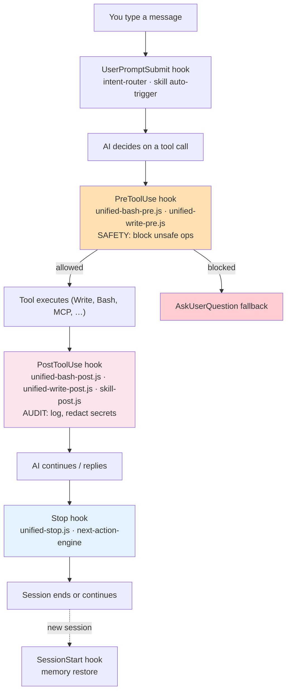

| Hook event | bkit script | What it stops or does |
|---|---|---|
| **SessionStart** | `hooks/session-start.js` | Restore memory; print Trust Level banner; warn about unfinished sprints |
| **UserPromptSubmit** | `scripts/user-prompt-handler.js` | Route intent; auto-trigger the right skill (`/pdca pm`, `/sprint`, …) based on 8-language keywords |
| **PreToolUse(Bash)** | `scripts/unified-bash-pre.js` | Block dangerous shell (rm -rf /, curl-to-shell, fork-bombs, …) before they run |
| **PreToolUse(Write/Edit)** | `scripts/unified-write-pre.js` | Block writes to protected paths; verify the file is in the active sprint scope |
| **PreToolUse(Skill)** | `scripts/skill-pre.js` | Inject skill context; verify the skill is allowed at the current Trust Level |
| **PostToolUse(Bash)** | `scripts/unified-bash-post.js` | Audit-log the command + exit code; scrub 7 PII patterns |
| **PostToolUse(Write/Edit)** | `scripts/unified-write-post.js` | Update docs-code index; recompute drift |
| **PostToolUse(Skill)** | `scripts/skill-post.js` | Emit skill-completion telemetry |
| **Stop / SubagentStop / SessionEnd** | `scripts/unified-stop.js` | Final audit entry; commit memory; fire the next-action-engine if a Sprint/PDCA phase wants to chain |
| **PreCompact** | `scripts/context-compaction.js` | Persist context before Claude Code compresses the conversation; defends `/compact` regressions (e.g., #47855 Opus 1M block) |

The point is: **safety is not your job**. You describe the work; bkit's hooks enforce the invariants.

### 4.4 8-language auto-trigger — type in your language, bkit picks the command

Skills and agents declare trigger keywords in 8 languages. The `intent-router` matches your input against all of them.

| Language | Sample trigger | Skill it activates |
|---|---|---|
| English | *"build login feature"* | `/pdca pm` |
| Korean (한국어) | *"로그인 기능 만들어줘"* | `/pdca pm` |
| Japanese (日本語) | *"ログイン機能を作って"* | `/pdca pm` |
| Chinese (中文) | *"创建一个登录功能"* | `/pdca pm` |
| Spanish (Español) | *"crear una función de inicio de sesión"* | `/pdca pm` |
| French (Français) | *"créer une fonction de connexion"* | `/pdca pm` |
| German (Deutsch) | *"Anmeldefunktion erstellen"* | `/pdca pm` |
| Italian (Italiano) | *"creare una funzione di accesso"* | `/pdca pm` |

You never need to know the English command name. You also never need to remember which of the 44 skills matches your intent — the keyword detection does that for you.

### 4.5 When to use which specialist team

Three subcommands of `/pdca` spawn different rosters. Pick by what you need *now*, not by phase name.

| You want… | Use | Roster |
|---|---|---|
| **Deep product analysis** — personas, market sizing, JTBD, pre-mortem before any code | `/pdca pm <feature>` | `pm-lead` orchestrates `pm-discovery` + `pm-strategy` + `pm-research` + `pm-prd` (4 agents, 43 frameworks) |
| **Parallel implementation** by multiple specialists — frontend, backend, QA, security all working at once | `/pdca team <feature>` | `cto-lead` orchestrates 4–6 specialists (developer · qa · frontend · backend · security · architect) |
| **Thorough QA** — full L1–L5 test plan, generated tests, runtime verification | `/pdca qa <feature>` | `qa-lead` orchestrates `qa-test-planner` + `qa-test-generator` + `qa-debug-analyst` + `qa-monitor` (4 agents) |
| **Sprint-level meta-orchestration** — multi-feature plan, dependency order, budget | `/sprint master-plan <project>` | `sprint-master-planner` (uses Context Sizer) |
| **One-shot single-feature run** | `/pdca pm <feature>` then auto-advance under Trust Level | The orchestrator picks the agent per phase |

---

## 5. Quality Gates & Self-Repair

A **quality gate** is a hard stop that won't let the workflow advance until a measurable condition is true. It's the mechanical version of a code reviewer who refuses to merge bad work — except this reviewer never sleeps, never has a bad day, and never lets a metric slide because it's Friday.

Every phase transition is gated. Failure pauses the run and writes an audit entry. **You don't have to remember to verify — verification is automatic.**

| Gate | Threshold | Triggered when | On failure |
|---|---|---|---|
| **M1** matchRate | ≥ 90 % | check phase ends | `pdca-iterator` auto-fires (Evaluator-Optimizer, max 5 cycles) |
| **M2** codeQualityScore | ≥ 80 | post-do | `code-analyzer` re-runs, user confirmation requested |
| **M3** criticalIssue count | 0 | post-do | Immediate pause, user escalation |
| **M4** conventionCompliance | ≥ 90 % | post-do | Lint auto-fix attempted |
| **M5** testCoverage | ≥ 70 % | post-qa | `qa-test-generator` adds tests |
| **M6** securityScore | ≥ 85 | post-do | `security-architect` review |
| **M7** documentationCompleteness | ≥ 90 % | post-report | Auto-doc generation |
| **M8** sprint matchRate | ≥ 85 % | sprint iterate phase | Sprint iterate loops (max 5) |
| **M9** contractInvariant | 0 violation | CI gate | Build blocked |
| **M10** regressionGuard | 0 new regression | post-iterate | `regression-registry` registers + monitors |
| **S1** dataFlowIntegrity | ≥ 85 % | sprint qa phase | 7-Layer hop re-verified (UI → Client → API → Validation → DB → Response → Client → UI) |

Thresholds live in `bkit.config.json`. Sprint-specific overrides via `sprint.config.{...}` at sprint init.

### What each gate protects you from — in plain language

| Gate | What it prevents | A failure looks like |
|---|---|---|
| **M1 matchRate** | The AI claiming "done" when half the design is missing | "We asked for login + signup + reset; AI shipped login only" → matchRate = 33 %, `pdca-iterator` fires |
| **M2 codeQualityScore** | Code that runs but is unreadable / unmaintainable | Long functions, deep nesting, magic numbers → 78 / 100 score, review re-runs |
| **M3 criticalIssue count** | Bugs that will break production | Hardcoded credentials, SQL injection, null deref → workflow pauses immediately |
| **M4 conventionCompliance** | Files that don't follow your existing style | Wrong indentation, mixed quotes, broken imports → lint auto-fix runs |
| **M5 testCoverage** | Code with no tests at all | New module ships with 0 % coverage → `qa-test-generator` adds tests |
| **M6 securityScore** | OWASP Top-10 type vulnerabilities | Missing input validation, unsafe deserialization → `security-architect` reviews |
| **M7 documentationCompleteness** | Code that nobody can pick up next quarter | API endpoint with no description → auto-doc fills gap |
| **M8 sprint matchRate** | Sprint declared done with one feature half-built | One of three features stuck at 70 % → sprint iterate loops, max 5 |
| **M9 contractInvariant** | Architecture decisions silently violated | Someone imports `fs` into the Domain layer → CI build blocked |
| **M10 regressionGuard** | A new bug that fixes another | Same test fails again after iterate → tracked, monitored |
| **S1 dataFlowIntegrity** | Front-end form that posts but back-end never receives it | UI → Client → API hop count check fails → 7-Layer trace runs |

### Worked example: a failure and the auto-repair

> *Scenario: you ask for a "user-auth" feature. The AI implements login but forgets the password-reset spec line.*

1. `/pdca check` runs. `gap-detector` reads `design.md` (3 specs: login, signup, reset) and the generated code (2 implemented).
2. **matchRate = 67 %.** M1 fails (threshold 90 %).
3. `pdca-iterator` auto-fires — no user input needed.
4. Cycle 1 — iterator reads the missing spec, adds the password-reset module → re-measure → 91 %.
5. M1 passes → workflow auto-advances to `qa`.

You only learn this happened from the audit log. **The AI fixed its own bug before you saw it.**

### The self-repair loop

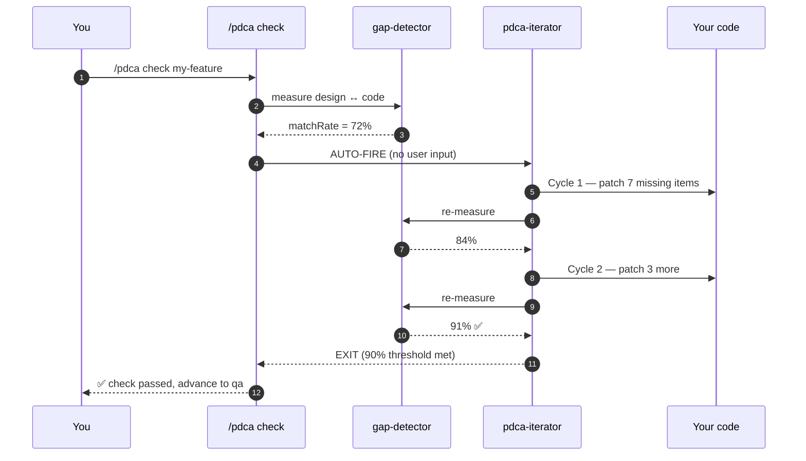

`/pdca iterate` is **not a button you press**. `gap-detector` detects sub-90 → `pdca-iterator` fires automatically. If the 5th cycle still fails, `ITERATION_EXHAUSTED` auto-pauses the sprint and escalates to you.

---

## 6. Trust Level & Control

`/control level N` is the single autonomy dial. It scopes how far `/sprint` and `/pdca` run before stopping — one knob, both surfaces.

| Level | Name | stopAfter | Pick when |
|---|---|---|---|
| **L0** | Manual | every phase | First-time user; inspect each output |
| **L1** | Guided | plan | Verify scope before AI implements |
| **L2** | Semi-Auto | do | **Default** — Plan/Design/Do auto, QA/Report manual |
| **L3** | Auto | qa | Trust implementation, double-check QA |
| **L4** | Full-Auto | archived | Fire-and-forget; pauses only on quality-gate failure or auto-pause trigger |

### Trust Score (0–100)

bkit computes a Trust Score from your recent track record (matchRate history, manual-override frequency, gate-pass rate). High scores can auto-escalate the level; low scores auto-downgrade. Override anytime with `/control level N`.

| Trust Score | Effect |
|---|---|
| ≥ 80 | `pdca-fast-track` available — auto-approves Checkpoints 1–8 |
| 60–79 | Defaults to L2 (Semi-Auto) |
| < 60 | Defaults to L1 (Guided) |

`autoEscalation` and `autoDowngrade` flags in `bkit.config.json:automation` decide whether bkit may change the level on its own.

### Which level should I pick?

If you're new to bkit, **start low and earn trust**. The Trust Score climbs automatically as your sprint history accumulates clean matchRate runs; bkit can offer to upgrade you when it's safe.

| Situation | Recommended level |
|---|---|
| Day 1 with bkit, you want to see what each phase produces | **L0 Manual** — inspect every output |
| You're confident the spec is right but want to review architecture choices | **L1 Guided** — stop after Plan |
| Daily driver — you trust planning and design but want to check QA yourself | **L2 Semi-Auto** *(default)* |
| You've shipped a few features with bkit and the matchRate is consistently > 95 % | **L3 Auto** — only Report is manual |
| Overnight run, fire-and-forget, you'll review the report tomorrow | **L4 Full-Auto** — pauses only on a quality-gate failure or auto-pause trigger |

The dial is reversible. Drop it back down whenever you want; the next phase respects the new setting.

---

## 7. Sprint Management Deep-Dive

### 7.1 The 8-phase sprint lifecycle

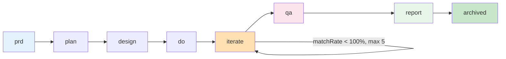

| Phase | Output | Agent |
|---|---|---|
| prd | `docs/00-pm/<sprint>.prd.md` | sprint-master-planner |
| plan | `docs/01-plan/features/<sprint>.plan.md` | sprint-master-planner |
| design | `docs/02-design/features/<sprint>.design.md` | sprint-master-planner |
| do | Per-feature PDCA cycles run inside | sprint-orchestrator |
| iterate | `docs/03-analysis/<sprint>.iterate.md` (per cycle) | pdca-iterator (delegated) |
| qa | `docs/05-qa/<sprint>.qa.md` (7-Layer S1) | sprint-qa-flow |
| report | `docs/04-report/features/<sprint>.report.md` | sprint-report-writer |
| archived | Terminal state; sprint state preserved | — |

### 7.2 The 4 auto-pause triggers

A sprint pauses automatically on any of these. Resume with `/sprint resume <id>` after fixing the root cause.

| Trigger | Condition | Most common cause |
|---|---|---|
| `QUALITY_GATE_FAIL` | Any M-gate or S1 fails | matchRate stuck below 90 % after iterate exhausts |
| `ITERATION_EXHAUSTED` | iterate phase exceeds 5 cycles | Gap too large to auto-fix; needs human intervention |
| `BUDGET_EXCEEDED` | Token usage > sprint budget (default 1 M) | Feature scope underestimated |
| `PHASE_TIMEOUT` | Phase exceeds timeout (default 4 h) | Hung or blocked |

### 7.3 Sprint vs PDCA vs pdca-batch — pick one

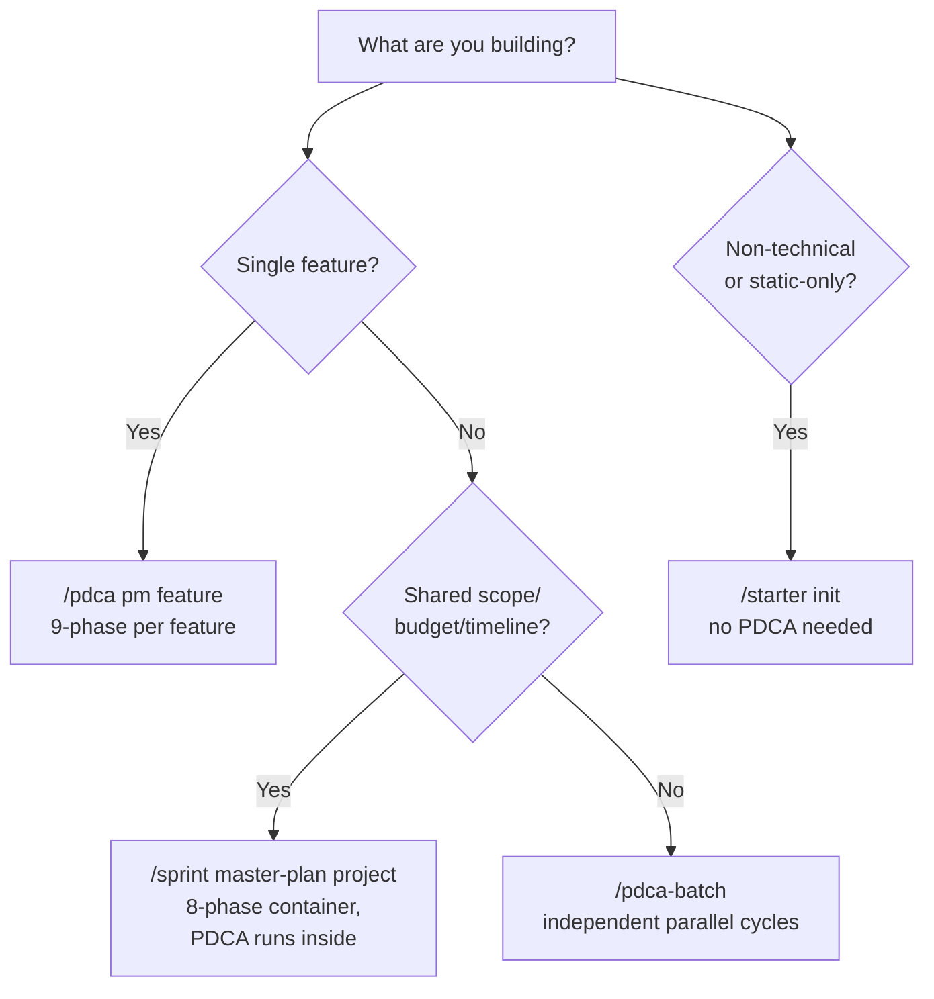

Deep-dive guide: [`docs/06-guide/sprint-management.guide.md`](docs/06-guide/sprint-management.guide.md). PDCA ↔ Sprint migration mapping: [`docs/06-guide/sprint-migration.guide.md`](docs/06-guide/sprint-migration.guide.md).

---

## 8. Agent Teams

bkit ships 34 agents organised into specialist teams. Three teams matter most for the daily workflow:

### 8.1 PM Agent Team — `/pdca pm <feature>`

Runs **before** the Plan phase to produce a comprehensive PRD via automated product discovery. Based on [pm-skills](https://github.com/phuryn/pm-skills) by Pawel Huryn (MIT).

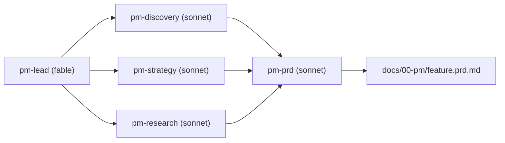

### 8.2 CTO-Led Team — `/pdca team <feature>`

Parallel implementation with multiple specialists.

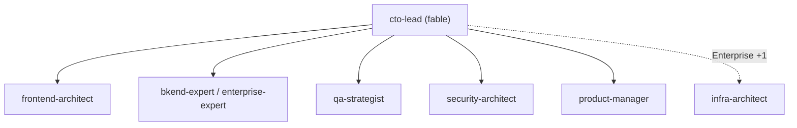

| Level | Teammates | Default roster |
|---|---|---|
| Dynamic | 3 | developer · qa · frontend |
| Enterprise | 5 | architect · developer · qa · reviewer · security |
| Enterprise + Sprint (v2.1.13) | 6 | + sprint-orchestrator |

**Requirements**: `CLAUDE_CODE_EXPERIMENTAL_AGENT_TEAMS=1` + Claude Code v2.1.32+.

### 8.3 QA Lead Team — `/pdca qa <feature>`

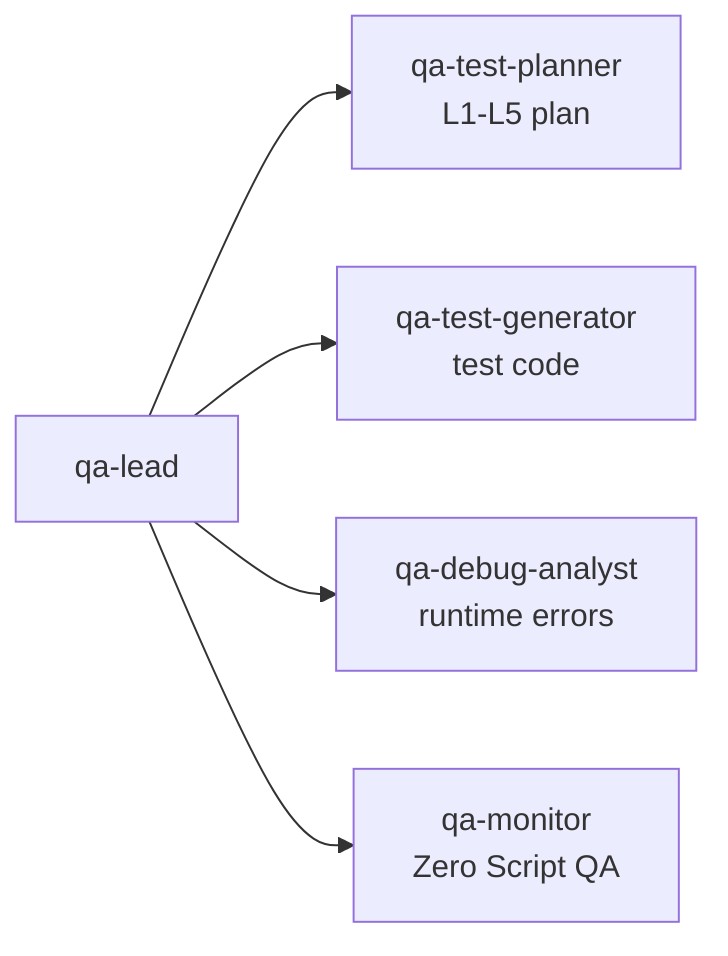

### 8.4 Sprint Team — added in v2.1.13

| Agent | Role |
|---|---|
| `sprint-master-planner` | Writes Context-Anchor-driven master plan; invokes Context Sizer |
| `sprint-orchestrator` | Advances sprint 8 phases; spawns PDCA per feature in `do` |
| `sprint-qa-flow` | Runs 7-Layer S1 dataFlow integrity check |
| `sprint-report-writer` | Aggregates phase + iterate history + KPI + lessons learned |

---

## 9. Architecture

### 9.1 Clean Architecture 4-Layer

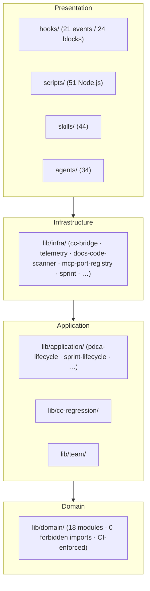

### 9.2 Component inventory (v2.1.13, measured 2026-05-12)

| Surface | Count | Notes |
|---|---|---|
| Skills | 44 | +`sprint` added v2.1.13 |
| Agents | 34 | +4 sprint agents added v2.1.13 (sprint-master-planner · sprint-orchestrator · sprint-qa-flow · sprint-report-writer) |
| Hook events / blocks | 21 / 24 | Invariant maintained |
| MCP servers / tools | 2 / 19 | +3 sprint tools (bkit_sprint_list · bkit_sprint_status · bkit_master_plan_read) |
| Lib modules / subdirs | 190 / 22 | +`lib/application/sprint-lifecycle/` (13 modules) + `lib/infra/sprint/` (9 modules) |
| Scripts | 51 | +`sprint-handler.js` (660 LOC) + `sprint-memory-writer.js` (138 LOC) |
| Templates | 39 | +7 sprint templates |
| Test files / cases | 118+ / 4,000+ | +`tests/contract/v2113-sprint-contracts.test.js` (10 SC contracts) |
| ACTION_TYPES | 20 | +sprint_paused · sprint_resumed · master_plan_created · task_created |
| CATEGORIES | 11 | +sprint |
| Port↔Adapter pairs | 7 | cc-payload · state-store · regression-registry · audit-sink · token-meter · docs-code-index · mcp-tool |

### 9.3 Defense-in-Depth 4-Layer

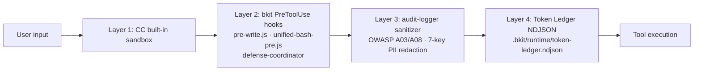

### 9.4 3-Layer Orchestration

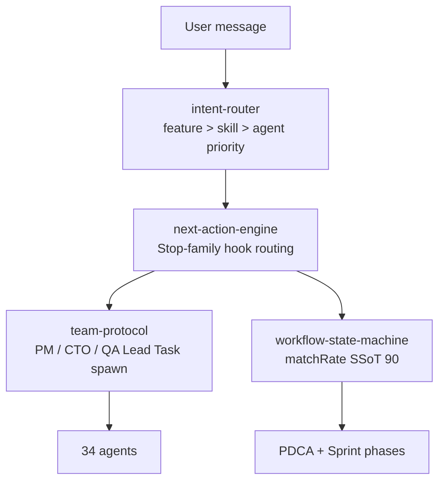

### 9.5 Invocation Contract L1–L5

| Level | What | Count | Where |
|---|---|---|---|
| L1 | Contract baseline JSON | 94 | `tests/contract/baseline.json` |
| L2 | Hook attribution smoke | 98 TC | `tests/integration/hooks/` |
| L3 | MCP stdio runtime | 42 TC | `tests/contract/l3-mcp-stdio.test.js` |
| L3 (v2.1.13) | Sprint cross-sprint contracts | 10 TC (SC-01~10) | `tests/contract/v2113-sprint-contracts.test.js` |
| L5 | E2E shell scenarios | 5 | `tests/e2e/run-all.sh` |

CI gate `contract-check.yml` enforces 226+ assertions.

---

## 10. Skill Evals

bkit extends Claude Code's Skill Evals into a **complete skill lifecycle management** system: *"are my skills still worth keeping?"*

### 10.1 Three layers over native evals

| Layer | Claude Code native | bkit enhancement |
|---|---|---|
| Eval execution | Basic runner | `evals/runner.js` with benchmark mode + 29 eval definitions |
| A/B testing | Not available | `evals/ab-tester.js` compares skill performance across models |
| Classification | Not available | All 44 skills classified Workflow / Capability / Hybrid with deprecation-risk scoring |

### 10.2 Skill classification

| Class | Count | Purpose | What evals measure |
|---|---|---|---|
| Workflow | 17 | Process automation (PDCA, pipelines) | Regression — these skills are permanent |
| Capability | 18 | Model ability augmentation | **Parity testing** — can the model match the skill's output without it? |
| Hybrid | 1 | Both process + capability | Both regression and parity |

When a model upgrade makes a Capability skill redundant, the Model Parity Test detects it:

```bash
# Does the model produce equivalent results without this skill?
node evals/ab-tester.js --parity phase-3-mockup --model claude-opus-4-8

# Compare skill performance between two models
node evals/ab-tester.js --skill pdca --modelA claude-sonnet-5 --modelB claude-opus-4-8

# Run all 29 skill evaluations
node evals/runner.js --benchmark
```

> **Philosophy**: bkit's third principle is *No Guessing*. Skill Evals replace intuition with measurement.

---

## 11. Installation & Customization

### 11.1 Marketplace install (recommended)

```bash
# Step 1: Add bkit marketplace
/plugin marketplace add popup-studio-ai/bkit-claude-code

# Step 2: Install bkit plugin
/plugin install bkit

# Step 3: (Optional) Enable Agent Teams
export CLAUDE_CODE_EXPERIMENTAL_AGENT_TEAMS=1
```

| Plugin | Best for |
|---|---|
| **bkit** | Full PDCA methodology + Sprint Management for experienced developers |
| **bkit-starter** | Korean learning guide for first-time Claude Code users |

### 11.2 Customization (project-local overrides)

Claude Code searches in this priority order:

1. **Project `.claude/`** (your customizations — highest priority)
2. **User `~/.claude/`**
3. **Plugin installation** (default)

```bash
# Step 1: Find the plugin installation
ls ~/.claude/plugins/bkit/

# Step 2: Copy only the file you want to customize
mkdir -p .claude/skills/starter
cp ~/.claude/plugins/bkit/skills/starter/SKILL.md .claude/skills/starter/

# Step 3: Edit; your version overrides the plugin's
```

Full guide with platform paths + license attribution: [CUSTOMIZATION-GUIDE.md](CUSTOMIZATION-GUIDE.md).

⚠️ **CC v2.1.113+ Users — `~/.claude/skills/` may be silently deleted on first run** ([#51234](https://github.com/anthropics/claude-code/issues/51234)). bkit plugin itself is unaffected (uses `${CLAUDE_PLUGIN_ROOT}/skills/`). Back up user custom skills before upgrading.

---

## 12. Requirements

| Requirement | Minimum | Recommended | Notes |
|---|---|---|---|
| **Claude Code** | v2.1.78 | **v2.1.150** (conservative) · **v2.1.159** (balanced) | 112 consecutive compatible releases since v2.1.34 |
| **Node.js** | v18+ | — | Hook script execution |
| **Agent Teams (optional)** | `CLAUDE_CODE_EXPERIMENTAL_AGENT_TEAMS=1` | — | Required for `/pdca team` |

> **Troubleshooting**: If you see `"Failed to load hooks"` after install, run `claude update`.

---

## 13. Language Support

bkit auto-detects 8 languages from trigger keywords:

| Language | Trigger sample |
|---|---|
| English | static website, beginner, API design |
| Korean | 정적 웹, 초보자, API 설계 |
| Japanese | 静的サイト, 初心者, API設計 |
| Chinese | 静态网站, 初学者, API设计 |
| Spanish | sitio web estático, principiante |
| French | site web statique, débutant |
| German | statische Webseite, Anfänger |
| Italian | sito web statico, principiante |

Set your reply language with `language` in `.claude/settings.json`:

```json
{ "language": "korean" }
```

Trigger keywords work in any language regardless of the reply setting.

---

## 14. License & Contributing

| | |
|---|---|
| **License** | Apache 2.0 · [LICENSE](LICENSE) · [NOTICE](NOTICE) (required for redistribution) |
| **Copyright** | 2024–2026 POPUP STUDIO PTE. LTD. |
| **Contributing** | [CONTRIBUTING.md](CONTRIBUTING.md) — `main` requires admin merge + PR review |
| **Issues** | [GitHub Issues](https://github.com/popup-studio-ai/bkit-claude-code/issues) |
| **Email** | `contact@popupstudio.ai` |

### Release history

bkit follows [Semantic Versioning](https://semver.org/). **All release notes live in [CHANGELOG.md](CHANGELOG.md)** and are not duplicated here.

---

Made with AI by [POPUP STUDIO](https://popupstudio.ai)
