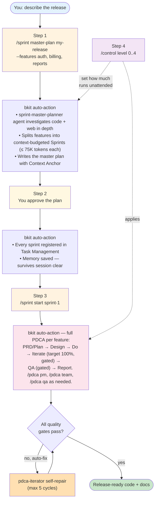

# bkit — AI Native Development OS

> The only Claude Code plugin that verifies AI-generated code against its own design specs.

**Three commands. Anyone — even someone vibe-coding for the first time — can ship robust, production-quality software.** bkit turns Claude Code into a *Context Engineering system*: 44 skills, 34 specialist agents, 11 quality gates, and a memory that survives across sessions deliver the right context to the AI at the right moment, so you don't have to know prompts, commands, or PDCA to get high-quality results.

[](https://opensource.org/licenses/Apache-2.0)
[](https://code.claude.com)
[](CHANGELOG.md)
[](https://popupstudio.ai)

> **Requirement**: bkit requires Claude Code **v2.1.143 or later** (the strict plugin-manifest path recognizes the official `displayName` field only from v2.1.143). On older Claude Code you will see `Validation errors: Unrecognized key: "displayName"` during `claude plugin install`. Run `npm install -g @anthropic-ai/claude-code@latest` to upgrade, or see [`docs/06-guide/cc-compatibility.guide.md`](docs/06-guide/cc-compatibility.guide.md).

---

## Who bkit is for

| You are… | bkit gives you |
|---|---|
| 🌱 **First-time vibe coder** — you describe what you want and AI codes for you, but you don't yet know how to tell if the result is correct | A safety net. AI proposes, bkit measures the result against its own design spec, and **auto-repairs** the gap when it drifts. You can ship without becoming a senior engineer first. |
| 👤 **Solo developer / indie builder** | A team-in-a-box. `/pdca team` spawns 4–6 specialist agents in parallel — frontend, backend, QA, security — orchestrated by an AI tech lead. |
| 👥 **Team lead planning a release** | Sprint Management. `/sprint master-plan` splits your release into **context-budgeted sprints** so a single Claude Code session can finish each one without running out of memory, and resumes after any session interruption. |
| 🌐 **Non-English speaker** | 8-language auto-detection. Type *"로그인 기능 만들어줘"* or *"作成新功能"* and bkit picks the right command for you. |

## What you'll achieve with bkit

> **The promise**: anyone — including non-developers — can build **robust, production-quality software** by using bkit. bkit replaces the senior engineer's intuition with a workflow.

| Without bkit | With bkit |
|---|---|
| AI gives you plausible code; you have no way to know if it really matches what you asked for | `gap-detector` measures **match rate** between your design spec and the generated code. Below 90 % → bkit auto-repairs (up to 5 cycles). |
| You only spot drift at PR review — by then the cleanup is expensive | 11 **Quality Gates** halt the workflow before drift compounds (match rate, critical issues, convention, test coverage, security, dataFlow integrity, …) |
| Long projects exceed Claude Code's session window and you lose context | bkit splits the project into **context-budgeted Sprints** (≤ 75 K tokens each); memory + Task Management lets any session resume where the last one stopped |
| You don't know which command, agent, or skill to use | **8-language auto-trigger** + intent-router pick the right skill / agent automatically. You just describe what you want. |
| AI ships code, you ship hope; nobody documents what changed | **Docs = Code** philosophy: every feature produces a PRD + plan + design + analysis + completion report. The history is the audit trail. |

## The 4-step experience

This is the canonical workflow when you use bkit. You describe a release; bkit handles the rest.



### Step 1 — Plan the release in depth

You type: `/sprint master-plan my-release --features auth, billing, reports`.

bkit's `sprint-master-planner` agent **investigates carefully — not quickly**. Depending on what you're building, it reads your existing code base in depth or researches the web, then writes a master plan. Critically, it splits your features into **context-budgeted Sprints**: each sprint is sized so a single Claude Code session can finish it without overflowing the context window (the default is ≤ 75 K tokens per sprint, dependency-aware via Kahn topological sort + greedy bin-packing).

You can also call specialist agents directly when you want more depth: `/pdca pm` runs 4 product-management agents in parallel with 43 frameworks; `/pdca team` spawns a multi-specialist implementation team; `/pdca qa` runs a 5-agent QA team.

### Step 2 — Approve, register, remember

You read the master plan. When you approve, bkit registers **every sprint** in its Task Management System with the right dependency order (Kahn-topologically sorted). It also writes to memory.

This means: if your laptop crashes, your session clears, or you start a new Claude Code session next week — **bkit picks up exactly where you stopped**. The plan and progress are durable.

### Step 3 — Auto-run each sprint through PDCA

You type: `/sprint start sprint-1`.

bkit runs the 8-phase Sprint lifecycle (prd → plan → design → do → iterate → qa → report → archived). Inside the **do** phase, bkit runs the full **PDCA loop once per feature**:

| Phase | What runs | Output |
|---|---|---|
| **PRD / Plan** | `pm-lead` orchestrates 4 PM agents (discovery, strategy, research, prd) with 43 frameworks | Comprehensive PRD + plan with Context Anchor |
| **Design** | `cto-lead` proposes 3 architecture options; you pick one (the only required user input) | Detailed design doc |
| **Do** | `/pdca team` spawns 4–6 specialist agents in parallel (developer, qa, frontend, backend, security, architect) | Working code |
| **Iterate** | Target **100 % match** between design and code. `gap-detector` measures; `pdca-iterator` self-repairs until quality gate M1 (matchRate ≥ 90 %) passes. Max 5 cycles. | Repaired code + iteration report |
| **QA** | `qa-lead` runs 4 QA agents through L1–L5 tests + dataFlow integrity (S1 gate, 7-layer hop check) | QA report |
| **Report** | `report-generator` writes the completion report | Final report with KPI + lessons learned |

**Every phase is gated by quality thresholds**. If anything fails — match rate too low, critical issue found, dataFlow broken — bkit pauses and tells you why. You don't have to remember to verify; verification is automatic.

### Step 4 — Govern with one dial

`/control level N` is the single autonomy knob. It decides how far the orchestrator runs before stopping. **The same dial controls both Sprint and PDCA** — no second knob to manage.

| Level | What it means |
|---|---|
| **L0 Manual** | Ask me at every phase. Best for your first sprint — inspect each output. |
| **L2 Semi-Auto** (default) | Plan/Design/Do auto; ask me on QA and Report. |
| **L4 Full-Auto** | Wake me when the sprint is done. Pauses only on a quality gate failure or one of 4 auto-pause triggers. |

L1 (Guided) and L3 (Auto) sit between. bkit also computes a **Trust Score (0–100)** from your track record and can recommend a level — but you stay in charge.

## How the bkit author actually uses bkit

The 4-step experience above is the canonical flow. Here's the concrete recipe the person who built bkit uses every day — **two steps** — so you can copy it without needing to understand the full machinery underneath.

### Step A — Use Claude Code as a thinking amplifier *before* the master plan

The master plan is the single most important artifact in a sprint. Garbage in, garbage out. So **don't write it alone, and don't let bkit write it cold either.**

1. Open a fresh Claude Code session.
2. Talk through the release in plain language — what's the goal, who is it for, what could go wrong, what depends on what, what's still unknown? Let Claude Code push back.
3. Have it investigate — read your repo, search the web, surface edge cases you hadn't considered.
4. *Then* run `/sprint master-plan my-release --features ...`. By the time you do, your context is already saturated; the master plan reflects what you really meant, not a generic template.

This is what **Context Engineering** looks like in practice: you don't tune the perfect prompt — you saturate the context first, then let bkit synthesise.

### Step B — Hand the rest to Trust Level 4

Once you approve the master plan, the keyboard goes quiet until the final report lands. The bkit author picks one of two patterns based on release size:

| Release size | What you type | What happens |
|---|---|---|
| **Small–medium** — a few related features, single context budget | `/control level 4`, then `/sprint start <project>` once | bkit runs every sprint and every PDCA phase straight through to `archived`. You read the final report. |
| **Large** — many sprints, large total token budget, or cross-sprint dependencies | `/control level 4`, then `/sprint start <sprint-id>` per sprint in dependency order | Each sprint runs full-auto. You skim the sprint report before launching the next sprint — a natural checkpoint between context windows. |

**Trust Level 4 is not "no safety"**. The 11 quality gates and 4 auto-pause triggers still fire. bkit halts and asks for you only when a measurable rule fails. The dial removes the *unnecessary* pauses, not the necessary ones.

**The outcome, repeatable**: AI plans, designs, codes, self-verifies, self-repairs, tests, and writes the completion report. You provide intent — and the final ship/no-ship decision. Nothing else.

## The three commands

| Command | When to use | What it spawns | Output |
|---|---|---|---|
| **`/sprint`** | Multi-feature release (quarter, milestone, multiple linked features) | `sprint-master-planner`, `sprint-orchestrator`, `sprint-qa-flow`, `sprint-report-writer` | Master plan + 8-phase per sprint + cumulative report |
| **`/pdca`** | A single feature (or runs inside a sprint per feature) | `pm-lead`, `cto-lead`, `gap-detector`, `pdca-iterator`, `qa-lead`, `report-generator` (any of 34 agents) | PRD + plan + design + code + analysis + report |
| **`/control`** | Anytime — set autonomy | — | Updates Trust Level scope; affects both `/sprint` and `/pdca` |

## How bkit closes the AI-coding gap — Context Engineering

bkit is more than commands. It is a **Context Engineering system** that solves the root cause of AI-coding failures: the AI doesn't have the right context.

| The AI coding problem | bkit's Context Engineering answer |
|---|---|
| AI hallucinates because it doesn't know your conventions | 44 skills (PDCA, Sprint, PM frameworks, …) auto-injected based on intent |
| AI loses focus as the session grows | Memory + Task Management resumes across sessions; Sprints are context-budgeted |
| AI ships code that drifts from the spec | 11 Quality Gates + `gap-detector` measurement + `pdca-iterator` auto-repair |
| You only catch bugs at PR review | Phase-by-phase gating: drift is caught at every transition, not at the end |
| You need to remember the right command | 8-language auto-trigger + intent-router; type *"login 만들어줘"* or *"build login"* and bkit picks the path |
| AI sessions are ephemeral; no audit trail | Audit log + Token Ledger + `Docs = Code` philosophy: every decision is on disk |

## bkit's three philosophies (from [`bkit-system/philosophy/core-mission.md`](bkit-system/philosophy/core-mission.md))

| Principle | What it means for you |
|---|---|
| **Automation First** | You don't need to know PDCA, Sprint, or any command. Type what you want; bkit picks the right workflow. The state machine + workflow engine drive the rest. |
| **No Guessing** | If bkit isn't sure, it checks the docs. If still unsure, it asks you. It never makes up an answer. `gap-detector`, `design-validator`, and 11 quality gates enforce this. |
| **Docs = Code** | Every feature produces docs (PRD + plan + design + analysis + report). The docs are the contract; bkit verifies that the code matches. `scripts/docs-code-sync.js` enforces 0 drift in CI. |

## Quick start

```bash
# 1. Install (one time)
claude plugin install bkit

# 2. Enable parallel team execution (optional, recommended)
export CLAUDE_CODE_EXPERIMENTAL_AGENT_TEAMS=1

# 3. Your very first run — single feature
/pdca pm my-feature        # Describes what you want; bkit handles the rest

# 4. When you're ready for a multi-feature release
/sprint master-plan my-release --name "Q2 Launch" --features auth, billing, reports
# (You approve the plan)
/sprint start my-release-s1
```

Recommended Claude Code runtime: **v2.1.150** (conservative, stable) or **v2.1.159** (balanced, 112 consecutive compatible). Minimum **v2.1.78**.

## Quality gates — the safety net explained

A "quality gate" is a hard stop that won't let the workflow advance until a measurable condition is true. bkit ships 11 of them. The ones that matter most for new users:

| Gate | What it measures | If it fails |
|---|---|---|
| **M1 matchRate** | How much of your design actually appears in the code, 0–100 % | Below 90 % → `pdca-iterator` automatically rewrites the code (up to 5 cycles) |
| **M3 critical issues** | Security or correctness bugs flagged by `code-analyzer` | Any critical → workflow pauses, you decide |
| **S1 dataFlow integrity** | 7-layer check: UI → Client → API → Validation → DB → Response → Client → UI | Below 85 % → 7 hops re-verified one by one |

Full M1–M10 + S1 catalog in [README-FULL.md §5](README-FULL.md#5-quality-gates--self-repair).

## Architecture at a glance

44 skills · 34 agents · 21 hook events / 24 blocks · 2 MCP servers (19 tools) · 190 lib modules across 22 subdirs · 61 scripts · 40 templates · 118+ test files / 4,000+ test cases. Clean Architecture 4-Layer · Defense-in-Depth 4-Layer · Invocation Contract L1–L5 (226 CI-gated assertions).

Full architecture deep-dive: [README-FULL.md §9](README-FULL.md#9-architecture).

## Documentation

| Path | What's there |
|---|---|
| [README-FULL.md](README-FULL.md) | Full command reference, deep workflow internals, agent teams, architecture, Skill Evals |
| [CHANGELOG.md](CHANGELOG.md) | Release history (single source of truth) |
| [CUSTOMIZATION-GUIDE.md](CUSTOMIZATION-GUIDE.md) | Override any bkit component in your `.claude/` directory |
| [AI-NATIVE-DEVELOPMENT.md](AI-NATIVE-DEVELOPMENT.md) | The 6 AI-Native principles and how bkit implements them |
| [`bkit-system/philosophy/`](bkit-system/philosophy/) | Core mission, Context Engineering, PDCA methodology, AI-Native principles |
| [`docs/06-guide/sprint-management.guide.md`](docs/06-guide/sprint-management.guide.md) | Sprint Management deep-dive (English) |
| [`docs/06-guide/sprint-migration.guide.md`](docs/06-guide/sprint-migration.guide.md) | PDCA ↔ Sprint migration mapping (English) |

## 🌟 Real User Hall of Fame

bkit's quality is measured by how well it responds to real users running
bkit in production on their own projects. This section recognizes
**external dogfooders** whose precise bug reports + reproduction scripts
have been absorbed directly into bkit's regression test suite
(`test/e2e/external-dogfood/`).

### v2.1.19 (2026-05-30 — first entry)

- **[@pruge (James Kim)](https://github.com/pruge)** — `dandi-village-ledger`
  project. 10 GitHub issues over 1.5 days (#92–#107) driving bkit v2.1.17,
  v2.1.18 closes + the entire v2.1.19 Quality Maturation Sprint. 5 reproduction
  scenarios absorbed as E2E tests at `test/e2e/external-dogfood/dandi-*.test.js`.
  See [`docs/external-dogfooders/pruge.md`](docs/external-dogfooders/pruge.md)
  for the full contribution archive. **Thank you for trusting bkit with
  your production sprint.** 🙏

### v2.1.20 (2026-05-26 — second entry, first-follower effect validated)

- **[@bj (정병진)](https://github.com/popup-studio-ai/bkit-claude-code/issues)** —
  bkit v2.1.14 install incident (2026-05-26, `Validation errors: : Unrecognized
  key: "displayName"`). Precise error message + cache path + Cursor IDE
  environment metadata sharing drove the entire **v2.1.20 Marketplace
  Recovery Sprint** (14 features / 3 sub-sprints / 3 new ENH 321/322/323 /
  1 new ADR 0011 Plugin Manifest Schema Compliance Policy). Reproduction
  absorbed at `test/e2e/external-dogfood/cc-min-version.test.js` (5 TC,
  Lifecycle Stage 4 Regression Lock achieved). Triggered ADR 0006 §
  Empirical Validation Gate recovery (~30-day wire delay closed). See
  [`docs/external-dogfooders/bj.md`](docs/external-dogfooders/bj.md) for the
  full contribution archive. **Thank you for sharing the precise error
  message that scoped the entire sprint correctly.** 🙏

## 🚀 bkit Early Adopter Program

> Running bkit on a non-trivial production project and willing to file
> detailed bug reports with reproductions makes you part of bkit's
> quality system, not just a bug reporter.

Established **v2.1.19** (master plan §15.4 DA-1~DA-4, ENH-318 차별화 7/7).

**Benefits**:

- 🏆 Public recognition in this README + dedicated archive
- 🔒 Your reproduction scripts become permanent E2E regression tests
- 📊 Your activity directly powers bkit's Trust Score
  (`externalDogfoodFeedbackResponseRate` component, weight 0.05)
- 📝 CHANGELOG attribution on every release where your scenarios
  were absorbed
- 🤝 Direct line to bkit maintainers — priority issue triage,
  reproduction-script-first response

**How to join**: file your first detailed issue at
[bkit-claude-code/issues](https://github.com/popup-studio-ai/bkit-claude-code/issues)
with bkit version, reproduction steps, expected vs actual behavior,
and file:line references. See
[`docs/external-dogfooders/_README.md`](docs/external-dogfooders/_README.md)
for the full 5-stage User-Feedback Lifecycle and program structure.

> **DA-4 acquisition goal**: by v2.1.20 (30 days post-v2.1.19 GA),
> measure dogfooder population. **DA-4 status (v2.1.20)**: **N=2 confirmed**
> (@pruge + @bj) — first-follower effect validated. v2.1.21+ continues
> active outreach (CC marketplace narrative, community engagement) to
> grow N≥3.

## License

Apache 2.0 — see [LICENSE](LICENSE) and [NOTICE](NOTICE). POPUP STUDIO PTE. LTD. · `kay@popupstudio.ai`
