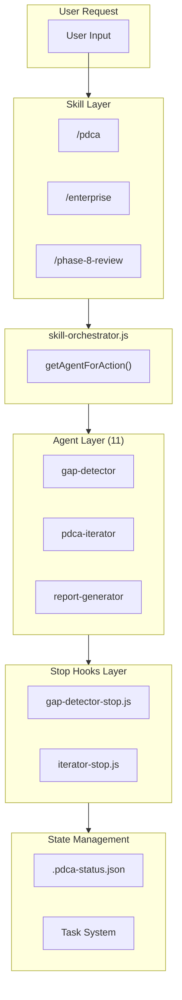
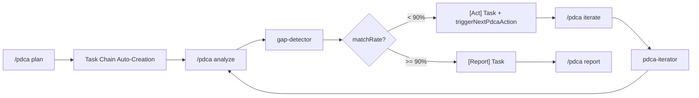

# bkit System Architecture

> Architecture guide documenting bkit plugin's internal structure and trigger system — **v2.1.13 GA (Sprint Management major feature + tech debt cleanup on top of v2.1.11 4 Sprints × 20 FRs Integrated Enhancement; v2.1.12 hotfix between)**.
>
> **Version history is maintained in a single source of truth**: see [CHANGELOG.md](../CHANGELOG.md) for the full release history (v1.0.0 → v2.1.13).
>
> Current release highlights (v2.1.13 over v2.1.12):
> - **Sprint Management (NEW v2.1.13 GA)**: 8-phase meta-container (`prd → plan → design → do → iterate → qa → report → archived`) — 16 sub-actions, 4 Auto-Pause Triggers (QUALITY_GATE_FAIL/ITERATION_EXHAUSTED/BUDGET_EXCEEDED/PHASE_TIMEOUT), Trust Level scope L0-L4 via `SPRINT_AUTORUN_SCOPE`, 7-Layer S1 dataFlowIntegrity QA, 4 sprint agents, 1 skill, 7 templates, 13 application-layer modules, 9 infrastructure adapters, 3 MCP tools, 1 L3 contract test (8 SC-01~08), 2 Korean guides, 2 ADRs (0006 + 0007)
> - **Tech Debt Cleanup**: net −2,333 LOC removed (7 legacy `templates/infra/*` removed)
> - **4 Sprints × 20 FRs** (v2.1.11 foundation): α Onboarding Revolution, β Discoverability, γ Trust Foundation, δ Port + Governance
> - **Clean Architecture 4-Layer with 7 Port↔Adapter pairs**: Domain (ports 7 + guards 4 + rules) / Application (cc-regression + pdca + pdca-lifecycle + **sprint-lifecycle** v2.1.13 + team) / Infrastructure (cc-bridge + telemetry + docs-code-scanner + mcp-port-registry + mcp-test-harness + cc-version-checker + branding + **sprint** v2.1.13) / Presentation (hooks + scripts)
> - **Defense-in-Depth 4-Layer**: CC Built-in → bkit PreToolUse → audit-logger sanitizer → Token Ledger NDJSON
> - **Invocation Contract L1~L5**: 226 CI-gated assertions + L2 smoke + L3 MCP stdio + L5 E2E shell + 8 v2.1.13 contract SC-01~08
> - **3-Layer Orchestration**: `lib/orchestrator/` 5 modules (intent-router + next-action-engine + team-protocol + workflow-state-machine + index) — v2.1.13 extended with sprint phase transition routing
> - **Guard Registry 21**: `lib/cc-regression/registry.js` with `expectedFix` auto-release via `lifecycle.reconcile()`
> - **BKIT_VERSION 5-location invariant**: `bkit.config.json` single SoT → `plugin.json` + `hooks.json` + `session-start.js` + `README.md` + `CHANGELOG.md` (F9-120 closure 9-streak PASS)
> - **One-Liner SSoT 5/5 (v2.1.11 α2)**: `lib/infra/branding.js` → `plugin.json` + `README.md` + `README-FULL.md` + `session-context.js` + `CHANGELOG.md`
> - **Quality Gates M1-M10 (v2.1.11 δ2)** + **Sprint S1 (v2.1.13)**: catalog `docs/reference/quality-gates-m1-m10.md` + invariant `scripts/check-quality-gates-m1-m10.js`
> - **i18n (v2.1.11 β3/β6)**: `lib/i18n/translator.js` + `detector.js` (KO/EN full + 6-lang fallback)
> - **Docs=Code CI**: `scripts/docs-code-sync.js` — counts (44 Skills · 34 Agents · 21:24 Hooks · 19 MCP Tools · 190 Lib · 61 Scripts) + 5-location version + One-Liner invariant, 0 drift enforced
> - **ACTION_TYPES 20** (v2.1.13: +sprint_paused/sprint_resumed/master_plan_created/task_created) + **CATEGORIES 11** (+sprint)

## Purpose of This Document

1. **Predictability**: Understand what features trigger based on user actions
2. **Testability**: Verify expected behavior per scenario
3. **Contributor Guide**: Understand relationships when adding new features

## Quick Links

- [[_GRAPH-INDEX]] - Obsidian graph hub (visualize all relationships)
- [[philosophy/core-mission]] - Core mission & 3 philosophies
- [[philosophy/context-engineering]] - Context Engineering principles ⭐ NEW
- [[triggers/trigger-matrix]] - Trigger matrix (core reference)
- [[scenarios/scenario-write-code]] - Code write flow

## Context Engineering Overview (v1.4.1)

bkit is a practical implementation of **Context Engineering**. Context Engineering is the discipline of optimally curating context tokens for LLM reasoning.

```
┌─────────────────────────────────────────────────────────────────┐
│              bkit Context Engineering Architecture              │
├─────────────────────────────────────────────────────────────────┤
│                                                                 │
│  ┌──────────────────┐  ┌──────────────────┐  ┌──────────────┐  │
│  │ Domain Knowledge │  │ Behavioral Rules │  │ State Mgmt   │  │
│  │    (44 Skills)   │  │   (34 Agents)    │  │(22 subdirs)  │  │
│  │                  │  │                  │  │              │  │
│  │ • 9-Phase Guide  │  │ • Role Def.      │  │ • PDCA v2.0  │  │
│  │ • 3 Levels       │  │ • Constraints    │  │ • Multi-Feat │  │
│  │ • 8 Languages    │  │ • Few-shot       │  │ • Caching    │  │
│  └────────┬─────────┘  └────────┬─────────┘  └──────┬───────┘  │
│           │                     │                    │          │
│           └─────────────────────┼────────────────────┘          │
│                                 ▼                               │
│  ┌──────────────────────────────────────────────────────────┐  │
│  │                Unified Hook System (v1.4.4)               │  │
│  │  L1: hooks.json (21 events - all hooks centralized)      │  │
│  │  L2: Unified Scripts (stop, bash-pre, write-post, etc.)  │  │
│  │  L3: Agent Frontmatter (constraints only)                │  │
│  │  L4: Description Triggers (keyword matching)             │  │
│  │  L5: Scripts (43 Node.js modules)                        │  │
│  └──────────────────────────────────────────────────────────┘  │
│                                 │                               │
│                                 ▼                               │
│  ┌──────────────────────────────────────────────────────────┐  │
│  │         Dynamic Context Injection                         │  │
│  │  • Task Size → PDCA Level                                │  │
│  │  • User Intent → Agent/Skill Auto-Trigger                │  │
│  │  • Ambiguity Score → Clarifying Questions                │  │
│  │  • Match Rate → Check-Act Iteration                      │  │
│  └──────────────────────────────────────────────────────────┘  │
│                                                                 │
└─────────────────────────────────────────────────────────────────┘
```

### Core Context Engineering Patterns

| Pattern | Implementation | Purpose |
|---------|----------------|---------|
| **Role Definition** | Agent frontmatter | Specify expertise, responsibility scope, level |
| **Structured Instructions** | Skill SKILL.md | Structure knowledge with checklists, tables, diagrams |
| **Few-shot Examples** | Agent/Skill prompts | Code patterns, output templates, conversation examples |
| **Constraint Specification** | Hook + Permission Mode | Tool restrictions, score thresholds, workflow rules |
| **State Injection** | SessionStart + Scripts | PDCA state, feature context, iteration counters |
| **Adaptive Guidance** | `lib/pdca/`, `lib/intent/` | Level-based branching, language-specific triggers, ambiguity handling |

Details: [[philosophy/context-engineering]]

## v1.4.7 Architecture

### Component Diagram (6-Layer)



### Data Flow (PDCA Cycle with Task Integration v1.4.7)



**v1.4.7 Task Chain Features:**
- Task Chain Auto-Creation: Plan→Design→Do→Check→Report tasks created on `/pdca plan`
- Task ID Persistence: Task IDs stored in `.pdca-status.json`
- Check↔Act Iteration: Max 5 iterations, 90% threshold
- Full-Auto Mode: manual/semi-auto/full-auto levels

### Component Dependencies (v1.4.7)

| Component | Depends On | Purpose |
|-----------|-----------|---------|
| `skill-orchestrator.js` | `lib/pdca/`, `lib/task/` | PDCA state + Task management |
| `gap-detector-stop.js` | `lib/common.js` → `lib/task/` | Task creation, triggerNextPdcaAction |
| `iterator-stop.js` | `lib/common.js` → `lib/task/` | Task update, phase transition |
| `pdca-skill-stop.js` | `lib/task/` | Task chain creation (v1.4.7) |
| `pdca` skill | `templates/*.md` | Template imports |
| `agents/*.md` | `skills` | `skills_preload` fields |

**Library Module Structure (v1.4.7):**
```
lib/
├── common.js              # Migration Bridge (re-exports all)
├── core/                  # Platform, cache, debug, config (7 files)
├── pdca/                  # PDCA phase, status, automation (6 files)
├── intent/                # Language, trigger, ambiguity (4 files)
└── task/                  # Classification, context, creator, tracker (5 files)
```

## System Overview

```
┌─────────────────────────────────────────────────────────────────┐
│                bkit Trigger System (v2.1.13)                     │
├─────────────────────────────────────────────────────────────────┤
│                                                                 │
│  ┌──────────────┐    ┌──────────────┐    ┌──────────────┐      │
│  │   Skills     │───▶│   Agents     │───▶│   Scripts    │      │
│  │  (44)        │    │  (34)        │    │  (51)        │      │
│  └──────────────┘    └──────────────┘    └──────────────┘      │
│         │                   │                   │               │
│         ▼                   ▼                   ▼               │
│  ┌──────────────────────────────────────────────────────┐      │
│  │                    Hooks Layer (21 events)            │      │
│  │  SessionStart │ UserPromptSubmit │ PreToolUse │       │      │
│  │  PostToolUse  │ PreCompact │ Stop │ SubagentStart │   │      │
│  │  SubagentStop │ TaskCompleted │ TeammateIdle │        │      │
│  │  PostCompact │ StopFailure │ SessionEnd │             │      │
│  │  PostToolUseFailure │ InstructionsLoaded │            │      │
│  │  ConfigChange │ PermissionRequest │ Notification │    │      │
│  │  CwdChanged │ TaskCreated │                           │      │
│  └──────────────────────────────────────────────────────┘      │
│                              │                                  │
│                              ▼                                  │
│  ┌──────────────────────────────────────────────────────┐      │
│  │              Claude Code Runtime                       │      │
│  └──────────────────────────────────────────────────────┘      │
│                                                                 │
└─────────────────────────────────────────────────────────────────┘
```

## Component Summary

| Component | Count | Role | Details |
|-----------|-------|------|---------|
| Skills | 43 | Domain knowledge + Slash commands (v2.1.11 added bkit-evals, bkit-explore, pdca-watch, pdca-fast-track) | [[components/skills/_skills-overview]] |
| Agents | 36 | Specialized task execution (13 opus / 21 sonnet / 2 haiku) | [[components/agents/_agents-overview]] |
| Commands | DEPRECATED | Migrated to Skills (v1.4.4) | - |
| Hooks | 21 events (24 blocks) | Event-based triggers (unified) | [[components/hooks/_hooks-overview]] |
| Scripts | 49 | Actual logic execution | [[components/scripts/_scripts-overview]] |
| Lib | 22 subdirectories, 190 modules | Clean Architecture 4-Layer with 7 Port↔Adapter pairs (Domain / Application / Infrastructure / Presentation) | See [CHANGELOG](../CHANGELOG.md#architecture-snapshot) |
| Evals | 28 | Skill evaluation definitions | Skill Creator + A/B Testing |
| Config | 1 | Centralized settings | `bkit.config.json` (BKIT_VERSION SSoT) |
| Templates | 18 | Document templates | PDCA + Pipeline + Shared |
| MCP Servers | 2 | Runtime tools for Claude Code | `bkit-pdca` + `bkit-analysis` (16 tools) |
| Output Styles | 4 | Response formatting | bkit-learning / bkit-pdca-guide / bkit-enterprise / bkit-pdca-enterprise |

## v2.1.11 Features

| Feature | Components | Discovery Mechanism |
|---------|-----------|---------------------|
| Onboarding Revolution (Sprint α) | `lib/infra/branding.js` + `lib/infra/cc-version-checker.js` + `hooks/startup/preflight.js` + `hooks/startup/first-run.js` | First-run AskUserQuestion tutorial; design anchor at `docs/02-design/styles/bkit-v2111-alpha-tutorial.design-anchor.md` |
| Discoverability (Sprint β) | `lib/discovery/explorer.js` + `lib/evals/runner-wrapper.js` + `lib/dashboard/watch.js` + `lib/control/fast-track.js` + `lib/i18n/{detector,translator}.js` | `/bkit explore` + `/bkit evals run` + `/pdca watch` + `/pdca fast-track` |
| Trust Foundation (Sprint γ) | `lib/control/trust-engine.js` (`reconcile()` + `syncToControlState()`) + `lib/application/pdca-lifecycle/{index,phases,transitions}.js` | `scripts/check-trust-score-reconcile.js` CI invariant; ADR 0004 + 0005 |
| Port + Governance (Sprint δ) | `lib/domain/ports/mcp-tool.port.js` + `lib/infra/mcp-port-registry.js` + `lib/pdca/token-report.js` + `docs/reference/quality-gates-m1-m10.md` + `scripts/release-plugin-tag.sh` | 7th Port↔Adapter pair; `scripts/check-quality-gates-m1-m10.js`; CAND-004 OTEL 3-attr |
| Clean Architecture 4-Layer | `lib/domain/` (ports 7 + guards 4 + rules) + `lib/application/` + `lib/infra/` + `lib/cc-regression/` + hooks/scripts | Auto-enforced by `scripts/check-domain-purity.js` (0 forbidden imports) |
| Defense-in-Depth 4-Layer | `scripts/pre-write.js` + `unified-bash-pre.js` + defense-coordinator + audit-logger + Token Ledger | `docs/03-analysis/security-architecture.md` |
| Invocation Contract L1~L5 | `test/contract/baseline/` (94+ JSON) + L2 smoke + L3 MCP stdio + L5 E2E shell | CI gate `contract-check.yml` (226 assertions) |
| 3-Layer Orchestration | `lib/orchestrator/` 5 modules (intent-router + next-action-engine + team-protocol + workflow-state-machine + index) | Used by `cto-lead` + Stop-family hooks |
| Guard Registry 21 | `lib/cc-regression/registry.js` | Daily cron `cc-regression-reconcile.yml` |
| Output Styles | 4 style files in `output-styles/` | Auto-suggested at SessionStart based on level |
| Agent Teams | `lib/team/` module (9 files) | Announced at SessionStart, suggested for major features |
| Agent Memory | `memory:` frontmatter in all 34 agents | Auto-active, mentioned at SessionStart |

## Trigger Layers

bkit triggers occur across 6 layers:

```
Layer 1: hooks.json (Global) → 21 events (24 blocks): SessionStart, UserPromptSubmit,
                                PreCompact, PostCompact, PreToolUse, PostToolUse,
                                Stop, StopFailure, SessionEnd, SubagentStart, SubagentStop,
                                TaskCompleted, TeammateIdle, Notification, ConfigChange,
                                PermissionRequest, InstructionsLoaded, CwdChanged,
                                TaskCreated, PostToolUseFailure + more
Layer 2: Unified Scripts     → unified-stop.js, unified-bash-pre.js, unified-write-post.js,
                                session-end-handler.js, subagent-stop-handler.js, etc.
Layer 3: Agent Frontmatter   → Constraints and role definitions (frontmatter hooks deprecated v1.4.4)
Layer 4: Description Triggers → "Triggers:" keyword matching (8 languages)
Layer 5: Scripts             → Actual Node.js logic execution (61 modules)
Layer 6: Lib Modules         → 22 subdirectories, 190 modules (Clean Architecture 4-Layer with 7 Port↔Adapter pairs)
```

> **Note (v1.4.4)**: All hooks centralized in hooks.json. SKILL.md frontmatter hooks deprecated (backward compatible).

Details: [[triggers/trigger-matrix]]

## Key Scenarios

| Scenario | Triggered Components | Details |
|----------|---------------------|---------|
| Code Write (Write/Edit) | 2-3 hooks + scripts | [[scenarios/scenario-write-code]] |
| New Feature Request | PDCA flow + agents | [[scenarios/scenario-new-feature]] |
| QA Execution | qa-monitor + scripts | [[scenarios/scenario-qa]] |

## Folder Structure

```
bkit-system/
├── README.md                  # This file
├── _GRAPH-INDEX.md            # Obsidian graph hub
├── philosophy/                # Design philosophy
│   ├── core-mission.md        # Core mission & 3 philosophies
│   ├── ai-native-principles.md # AI-Native development principles
│   └── pdca-methodology.md    # PDCA & Pipeline methodology
├── components/
│   ├── skills/                # Skill details
│   ├── agents/                # Agent details
│   ├── hooks/                 # Hook event reference
│   └── scripts/               # Script details
├── triggers/
│   ├── trigger-matrix.md      # Trigger matrix
│   └── priority-rules.md      # Priority rules
├── scenarios/                 # User scenario flows
└── testing/
    └── test-checklist.md      # Test checklist
```

## Source Locations

| Item | Path |
|------|------|
| Skills | `skills/*/SKILL.md` |
| Agents | `agents/*.md` |
| Scripts | `scripts/*.js` |
| Templates | `templates/*.md` |
| Hooks | `hooks/hooks.json` |
| Lib | `lib/audit/`, `lib/application/`, `lib/cc-regression/`, `lib/context/`, `lib/control/`, `lib/core/`, `lib/dashboard/`, `lib/discovery/`, `lib/domain/`, `lib/evals/`, `lib/i18n/`, `lib/infra/`, `lib/intent/`, `lib/orchestrator/`, `lib/pdca/`, `lib/qa/`, `lib/quality/`, `lib/task/`, `lib/team/`, `lib/ui/` |
| Config | `bkit.config.json` |
| Context | `CLAUDE.md` |
| Manifest | `.claude-plugin/plugin.json` |

> **Note (v1.5.0)**: bkit is now Claude Code exclusive. Gemini CLI support was removed.

> **Note**: The `.claude/` folder is not in version control. All plugin elements (skills, agents, scripts, templates, lib, output-styles, config) live at the repository root and are bundled via `.claude-plugin/plugin.json`. bkit is Claude Code exclusive since v1.5.0.

---

## Viewing with Obsidian

The bkit-system documentation is optimized for [Obsidian](https://obsidian.md/)'s Graph View, allowing you to visualize component relationships interactively.

### Option 1: Open bkit-system as a Vault (Recommended)

1. Open Obsidian
2. Click "Open folder as vault"
3. Select the `bkit-system/` folder
4. Press `Ctrl/Cmd + G` to open Graph View
5. Start from `_GRAPH-INDEX.md` to explore all connections

### Option 2: Open Project Root as a Vault

1. Open Obsidian
2. Click "Open folder as vault"
3. Select the project root folder
4. Navigate to `bkit-system/` in the file explorer
5. Open `_GRAPH-INDEX.md` and use Graph View

### Pre-configured Settings

The `bkit-system/.obsidian/` folder includes shared settings:

| File | Purpose | Shared |
|------|---------|:------:|
| `graph.json` | Optimized graph view layout | Yes |
| `core-plugins.json` | Required Obsidian plugins | Yes |
| `workspace.json` | Personal workspace state | No |
| `app.json` | Personal app settings | No |

> **Tip**: The graph settings are pre-configured for optimal visualization of bkit's 44 skills, 34 agents, 61 scripts, 190 lib modules (22 subdirs), and their relationships.

---

## v1.6.0 Features

### Skills 2.0 Integration

bkit v1.6.0 integrates CC 2.1.0 Skills 2.0 features:
- **Skill Classification**: 17 Workflow / 18 Capability / 1 Hybrid — Workflow skills are bkit's permanent core value
- **Skill Evals**: 28 eval definitions for data-driven skill quality measurement
- **Skill Creator + A/B Testing**: Create and compare skill variants systematically
- **Skill Hot Reload**: Live skill updates without session restart

### PM Agent Team (pre-Plan Product Discovery)

5 new PM Team agents for structured product discovery before PDCA Plan phase:
- `pm-lead` — PM Team orchestrator
- `pm-discovery` — Market and user research
- `pm-strategy` — Product strategy and positioning
- `pm-research` — Competitive analysis and data gathering
- `pm-prd` — PRD document generation

### Component Counts (v2.1.11 Final, runtime-measured 2026-04-28)

| Component | Count |
|-----------|-------|
| Skills | 43 (v2.1.11 added bkit-evals, bkit-explore, pdca-watch, pdca-fast-track) |
| Agents | 36 (13 opus / 21 sonnet / 2 haiku) |
| Lib Modules | 190 across 22 subdirectories |
| Scripts | 49 |
| Hook Events | 21 (24 blocks) |
| Templates | 18 |
| Output Styles | 4 |
| MCP Servers | 2 (bkit-pdca, bkit-analysis; 16 tools registered via `lib/infra/mcp-port-registry.js`) |
| Port↔Adapter pairs | 7 (cc-payload, state-store, regression-registry, audit-sink, token-meter, docs-code-index, mcp-tool) |
| Test Files | 117+ (qa-aggregate scope) |
| Test Cases | 4,000+ (3,762 baseline + 261 v2.1.11) |
| BKIT_VERSION SSoT | 2.1.11 (`bkit.config.json`) |
| CC Recommended | v2.1.118+ (79 consecutive compatible releases) |

> Measurement source: `scripts/docs-code-sync.js` + `find lib -name "*.js" -type f | wc -l`.
